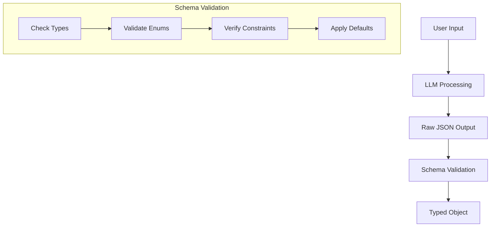
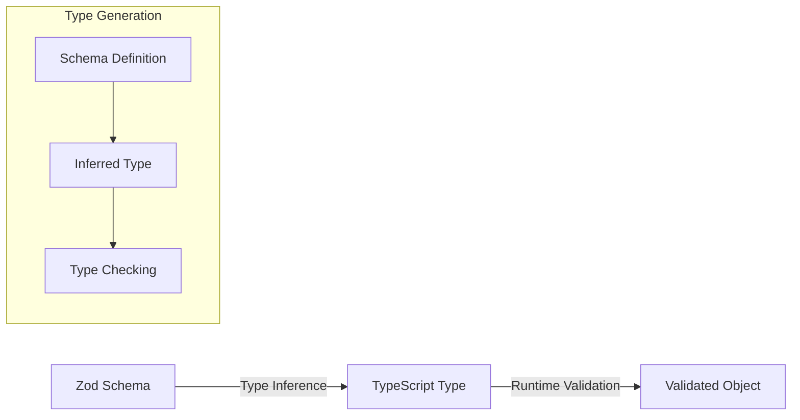
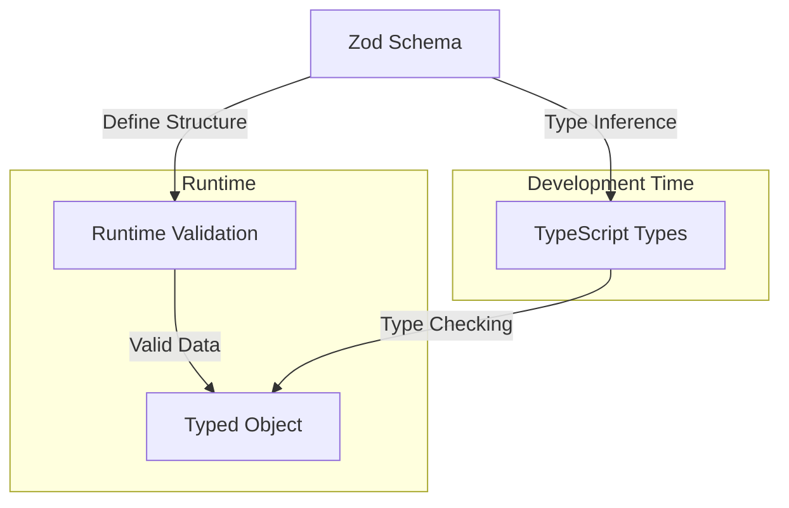

# Order Details Extraction Analysis

## Overview
The order details extraction process in the Dominos plugin uses a sophisticated system combining Large Language Models (LLM), context templates, and schema validation to accurately parse user pizza orders from natural language into structured data.

## Process Flow

### 1. Initial Setup
```typescript
const extractionTemplate = `
  Extract pizza order details from the following text. Include size, crust type, toppings, quantity, and any special instructions.
  If information is missing, use default values: medium size, hand tossed crust, no toppings, quantity 1.

  {{recentConversation}}

  Format the response as a JSON object...
`;
```

**Purpose**:
- Defines extraction parameters
- Sets default values
- Specifies output format
- Includes conversation context

### 2. Context Composition
```typescript
const context = composeContext({
    state,
    template: extractionTemplate,
});
```

**Operations**:
1. Merges current state
2. Injects conversation history
3. Applies template formatting
4. Prepares LLM context

### 3. Schema Definition
```typescript
const PizzaOrderSchema = z.object({
    size: z.enum(["SMALL", "MEDIUM", "LARGE", "XLARGE"]),
    crust: z.enum([
        "HAND_TOSSED",
        "THIN",
        "PAN",
        "GLUTEN_FREE",
        "BROOKLYN",
    ]),
    toppings: z.array(
        z.object({
            code: z.string(),
            portion: z.enum(["LEFT", "RIGHT", "ALL"]),
            amount: z.union([z.literal(1), z.literal(2)]),
        })
    ).optional(),
    quantity: z.number().int().positive(),
    specialInstructions: z.string().optional(),
});
```

**Validation Rules**:
1. Size enumeration
2. Crust type validation
3. Toppings structure
4. Quantity constraints
5. Optional fields

### 4. LLM Generation
```typescript
const orderDetails = await generateObjectV2({
    runtime,
    context,
    modelClass: ModelClass.LARGE,
    schema: PizzaOrderSchema,
});
```

**Process Steps**:
1. Context Preparation
   - Formats template
   - Injects conversation
   - Applies state

2. LLM Processing
   - Analyzes input text
   - Extracts order details
   - Applies defaults
   - Structures output

3. Schema Validation
   - Validates structure
   - Enforces types
   - Checks constraints
   - Handles defaults

## Example Flow

### 1. User Input
```plaintext
"I'd like a large pepperoni pizza with extra cheese"
```

### 2. Template Application
```plaintext
Extract pizza order details from the following text...

User: I'd like a large pepperoni pizza with extra cheese

Format the response as a JSON object...
```

### 3. LLM Processing
```typescript
// LLM analyzes input and generates structured response
{
    size: "LARGE",
    crust: "HAND_TOSSED", // Default value
    toppings: [
        {
            code: "PEPPERONI",
            portion: "ALL",
            amount: 1
        },
        {
            code: "CHEESE",
            portion: "ALL",
            amount: 2 // Extra cheese
        }
    ],
    quantity: 1,
    specialInstructions: ""
}
```

### 4. Schema Validation
```typescript
// Zod validates and types the response
const validatedOrder: z.infer<typeof PizzaOrderSchema> = {
    size: "LARGE",
    crust: "HAND_TOSSED",
    toppings: [
        {
            code: "PEPPERONI",
            portion: "ALL",
            amount: 1
        },
        {
            code: "CHEESE",
            portion: "ALL",
            amount: 2
        }
    ],
    quantity: 1,
    specialInstructions: ""
};
```

## Context Processing Details

### 1. Template Variables
```typescript
type TemplateVars = {
    recentConversation: string;
    orderHistory?: string;
    preferences?: string;
};
```

### 2. State Integration
```typescript
interface State {
    conversation: Message[];
    orderContext?: OrderContext;
    userPreferences?: UserPreferences;
}
```

### 3. Context Composition
```typescript
function composeContext({state, template}: {
    state: State;
    template: string;
}) {
    // 1. Extract recent conversation
    const recentMessages = state.conversation.slice(-5);
    
    // 2. Format conversation
    const formattedConversation = formatConversation(recentMessages);
    
    // 3. Apply template
    return template.replace(
        "{{recentConversation}}",
        formattedConversation
    );
}
```

## Error Handling

### 1. Schema Validation Errors
```typescript
try {
    const orderDetails = await generateObjectV2({...});
} catch (error) {
    if (error instanceof z.ZodError) {
        // Handle validation errors
        return "I couldn't understand some details of your order. Please specify...";
    }
}
```

### 2. Missing Information
```typescript
// Default values applied when information is missing
size: "MEDIUM", // Default size
crust: "HAND_TOSSED", // Default crust
toppings: [], // Default no toppings
quantity: 1 // Default quantity
```

### 3. Invalid Values
```typescript
// Schema ensures valid values
size: z.enum(["SMALL", "MEDIUM", "LARGE", "XLARGE"]),
crust: z.enum(["HAND_TOSSED", "THIN", "PAN", "GLUTEN_FREE", "BROOKLYN"]),
```

## Best Practices

### 1. Template Design
- Clear instructions
- Specific format requirements
- Default value specifications
- Error handling guidance

### 2. Schema Validation
- Strict type checking
- Comprehensive enums
- Required vs optional fields
- Reasonable constraints

### 3. Context Management
- Recent conversation inclusion
- State integration
- Preference consideration
- History awareness

## Implementation Tips

### 1. Robust Validation
```typescript
// Add custom validation
const PizzaOrderSchema = z.object({
    // ... base schema
}).refine(
    (data) => {
        // Custom validation logic
        return isValidCombination(data);
    },
    {
        message: "Invalid topping combination"
    }
);
```

### 2. Error Recovery
```typescript
try {
    const orderDetails = await generateObjectV2({...});
} catch (error) {
    // Fallback to default values
    return {
        size: "MEDIUM",
        crust: "HAND_TOSSED",
        quantity: 1
    };
}
```

### 3. Context Enhancement
```typescript
const enhancedTemplate = `
    ${extractionTemplate}
    Previous orders: {{orderHistory}}
    User preferences: {{preferences}}
`;
```

## Schema and Type Inference Deep Dive

### Schema-Based Generation
```typescript
const orderDetails = (await generateObjectV2({
    runtime,
    context,
    modelClass: ModelClass.LARGE,
    schema: PizzaOrderSchema,
})) as z.infer<typeof PizzaOrderSchema>;
```

#### How Schema Helps Create orderDetails



1. **Schema as Contract**
   ```typescript
   const PizzaOrderSchema = z.object({
       size: z.enum(["SMALL", "MEDIUM", "LARGE", "XLARGE"]),
       // ...
   });
   ```
   - Defines expected structure
   - Specifies valid values
   - Sets type constraints
   - Declares optional fields

2. **Generation Process**
   ```mermaid
   sequenceDiagram
       participant U as User Input
       participant L as LLM
       participant S as Schema
       participant V as Validator
       participant O as Output
       
       U->>L: Natural Language
       L->>S: Raw JSON
       S->>V: Validate Structure
       V->>O: Typed Object
   ```

3. **Validation Flow**
   - LLM generates JSON matching schema
   - Schema validates structure
   - Invalid data throws errors
   - Valid data becomes typed

### Type Inference with z.infer

```typescript
type PizzaOrder = z.infer<typeof PizzaOrderSchema>;
```

#### Understanding z.infer



1. **Type Extraction**
   ```typescript
   // Schema definition
   const PizzaOrderSchema = z.object({...});
   
   // Inferred type
   type PizzaOrder = {
       size: "SMALL" | "MEDIUM" | "LARGE" | "XLARGE";
       crust: "HAND_TOSSED" | "THIN" | "PAN" | "GLUTEN_FREE" | "BROOKLYN";
       toppings?: {
           code: string;
           portion: "LEFT" | "RIGHT" | "ALL";
           amount: 1 | 2;
       }[];
       quantity: number;
       specialInstructions?: string;
   };
   ```

2. **Type Safety Benefits**
   ```typescript
   // Type checking ensures:
   const order: PizzaOrder = {
       size: "HUGE",     // Error: Invalid size
       crust: "CRISPY",  // Error: Invalid crust
       quantity: "2"     // Error: Must be number
   };
   ```

3. **Runtime Validation**
   ```typescript
   try {
       const validOrder = PizzaOrderSchema.parse({
           size: "LARGE",
           crust: "HAND_TOSSED",
           quantity: 1
       });
       // validOrder is typed as PizzaOrder
   } catch (error) {
       // Validation failed
   }
   ```

### Schema to Type Pipeline



1. **Development Benefits**
   - Autocomplete support
   - Type checking
   - Error prevention
   - Documentation

2. **Runtime Benefits**
   - Data validation
   - Error handling
   - Type guarantees
   - Safe type casting

3. **Integration Example**
   ```typescript
   // Development time type checking
   const processOrder = (order: PizzaOrder) => {
       // TypeScript knows all possible values
       if (order.size === "LARGE") {
           // ...
       }
   };

   // Runtime validation
   const handleOrder = async (input: unknown) => {
       const order = await PizzaOrderSchema.parseAsync(input);
       // order is now typed as PizzaOrder
       processOrder(order);
   };
   ```

This schema-based approach provides:
1. Runtime type safety
2. Development-time type checking
3. Automatic type inference
4. Data validation
5. Error handling
