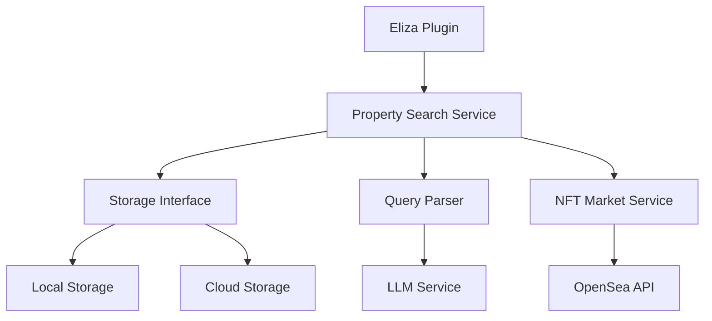
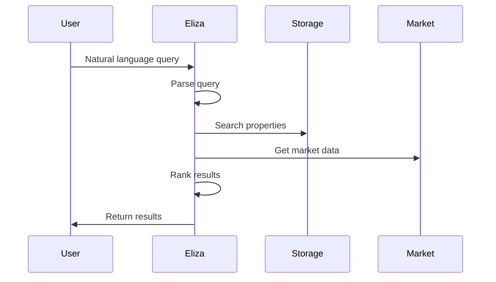

# 1. System Overview

## Architecture Overview

## Core Components

### 1. Property Search Service
Central coordinator that manages:
- Query processing
- Storage selection
- Result ranking
- Market data integration

### 2. Storage Interface
Abstract interface supporting:
- Vector similarity search
- Structured filters
- Batch operations

### 3. Query Processing
Multi-phase system:
1. Query understanding (Eliza)
2. Property search (Storage)
3. Market enrichment (OpenSea)

### 4. NFT Integration
Provides:
- Real-time pricing
- Market analysis
- Listing status

## System Flow

## Key Features

1. **Semantic Search**
   - Natural language queries
   - Vector similarity
   - Metadata filtering

2. **Market Integration**
   - Real-time prices
   - Listing status
   - Price history

3. **Flexible Storage**
   - Local development
   - Cloud scaling
   - Hybrid options

## Next Steps

1. **Implementation**
   - Start with storage abstraction
   - Add basic search
   - Integrate market data

2. **Enhancement**
   - Improve query parsing
   - Add advanced filters
   - Optimize performance

3. **Scale**
   - Deploy cloud service
   - Add caching
   - Monitor performance
