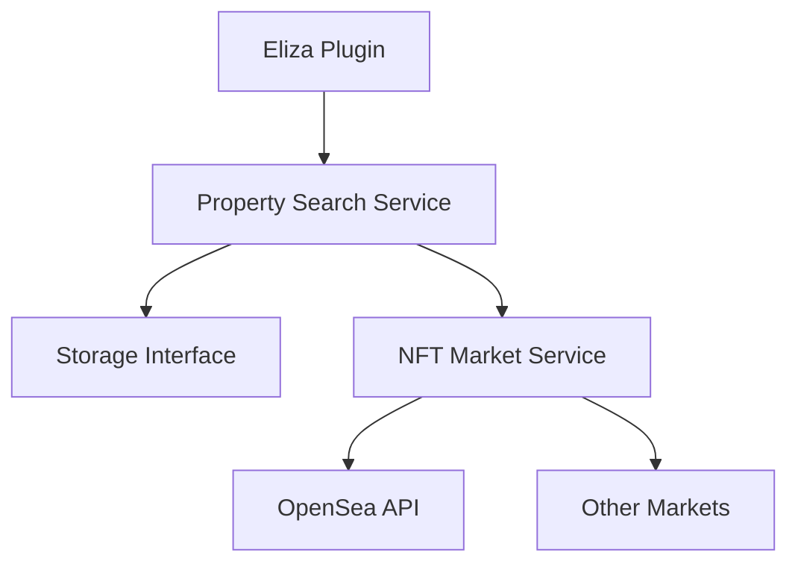

# NFT Property Integration Design

## Overview

Enhance the real estate semantic search with NFT marketplace integration, allowing users to find properties and view their market status.



## 1. Enhanced Data Model

```typescript
interface NFTMetadata {
    tokenId: string;
    contractAddress: string;
    blockchain: 'ethereum' | 'polygon';
    lastSalePrice?: number;
    lastSaleDate?: Date;
}

interface MarketStatus {
    isListed: boolean;
    currentPrice?: number;
    currency?: string;
    marketplace: 'opensea' | 'other';
    listingUrl?: string;
    lastUpdated: Date;
}

interface PropertyData {
    // ... existing fields ...
    nft: NFTMetadata;
    market?: MarketStatus;
}
```

## 2. OpenSea Integration

### 2.1 Market Data Fetching
```typescript
class OpenSeaService {
    async getListingStatus(nft: NFTMetadata): Promise<MarketStatus> {
        const asset = await this.api.getAsset({
            tokenAddress: nft.contractAddress,
            tokenId: nft.tokenId
        });

        return {
            isListed: asset.sellOrders?.length > 0,
            currentPrice: asset.sellOrders?.[0]?.currentPrice,
            currency: asset.sellOrders?.[0]?.paymentToken,
            marketplace: 'opensea',
            listingUrl: asset.permalink,
            lastUpdated: new Date()
        };
    }

    async getFloorPrice(contractAddress: string): Promise<number> {
        const collection = await this.api.getCollection(contractAddress);
        return collection.stats.floorPrice;
    }
}
```

### 2.2 Enhanced Search Features
```typescript
interface NFTSearchOptions extends SearchOptions {
    onlyListed?: boolean;
    maxPrice?: number;
    minPrice?: number;
    sortByPrice?: 'asc' | 'desc';
}

interface PropertyStorage {
    // ... existing methods ...
    searchByMarketStatus(
        options: NFTSearchOptions
    ): Promise<SearchResult[]>;
}
```

## 3. Example Queries

```typescript
// Find listed properties near the ocean
const results = await propertySearch.search({
    query: "oceanfront property",
    marketOptions: {
        onlyListed: true,
        sortByPrice: 'asc'
    }
});

// Get floor price history
const trends = await marketService.getPriceHistory({
    neighborhood: "Nexus",
    timeRange: "30d"
});
```

## 4. Natural Language Integration

```typescript
// Enhanced query parsing
const query = "find cheap listed properties in Nexus under 5 ETH";

const parsed = {
    filters: {
        operator: "AND",
        filters: [
            { field: "neighborhood", operator: "$eq", value: "Nexus" },
            { field: "market.isListed", operator: "$eq", value: true },
            { field: "market.currentPrice", operator: "$lt", value: 5 }
        ]
    }
};
```

## 5. Example Response

```typescript
{
    property: {
        name: "NX-1",
        neighborhood: "Nexus",
        // ... other property data ...
        nft: {
            tokenId: "1234",
            contractAddress: "0x..."
        },
        market: {
            isListed: true,
            currentPrice: 3.5,
            currency: "ETH",
            listingUrl: "https://opensea.io/assets/...",
            lastUpdated: "2024-12-27T10:27:26Z"
        }
    },
    similarity: 0.92,
    marketAnalysis: {
        comparedToFloor: "+10%",
        priceHistory: [
            { date: "2024-11-27", price: 3.2 },
            { date: "2024-12-27", price: 3.5 }
        ]
    }
}
```

## 6. New Search Capabilities

Users can now search by:
- Current listing status
- Price range
- Recent sales
- Price trends
- Floor price comparison

Example queries:
```typescript
"find properties listed below floor price"
"show me the cheapest oceanfront properties for sale"
"what's for sale in Nexus with good price history?"
```

## 7. Market Analysis Features

```typescript
interface MarketAnalysis {
    // Price trends
    getPriceHistory(options: {
        neighborhood?: string;
        propertyType?: string;
        timeRange: string;
    }): Promise<PriceTrend[]>;

    // Market activity
    getMarketActivity(options: {
        timeRange: string;
        metric: 'sales' | 'listings' | 'volume';
    }): Promise<ActivityData[]>;

    // Neighborhood comparison
    compareNeighborhoods(options: {
        neighborhoods: string[];
        metrics: ('price' | 'volume' | 'activity')[];
    }): Promise<ComparisonData>;
}
```

## 8. Implementation Strategy

### Phase 1: Basic Integration
- ✅ Add NFT metadata to properties
- ✅ Basic OpenSea API integration
- ✅ Simple listing status checks

### Phase 2: Enhanced Search
- 🔄 Price-based filtering
- 🔄 Market status in search results
- 🔄 Natural language understanding for market terms

### Phase 3: Market Analysis
- ⏳ Historical price tracking
- ⏳ Market trends analysis
- ⏳ Neighborhood comparisons

### Phase 4: Advanced Features
- 📋 Price predictions
- 📋 Investment recommendations
- 📋 Market alerts

## 9. Example Use Cases

1. **Value Hunters**
   ```typescript
   "find properties listed below neighborhood average"
   ```

2. **Market Watchers**
   ```typescript
   "show me properties with increasing price trend"
   ```

3. **Location Focused**
   ```typescript
   "oceanfront properties in Nexus listed under 10 ETH"
   ```

4. **Investment Analysis**
   ```typescript
   "compare property prices between Nexus and Flashing Lights"
   ```

This integration would make the search system much more powerful for NFT property trading, allowing users to combine location and property features with market data for better decision-making.
