# Property Storage Architecture Diagrams

## Class Hierarchy
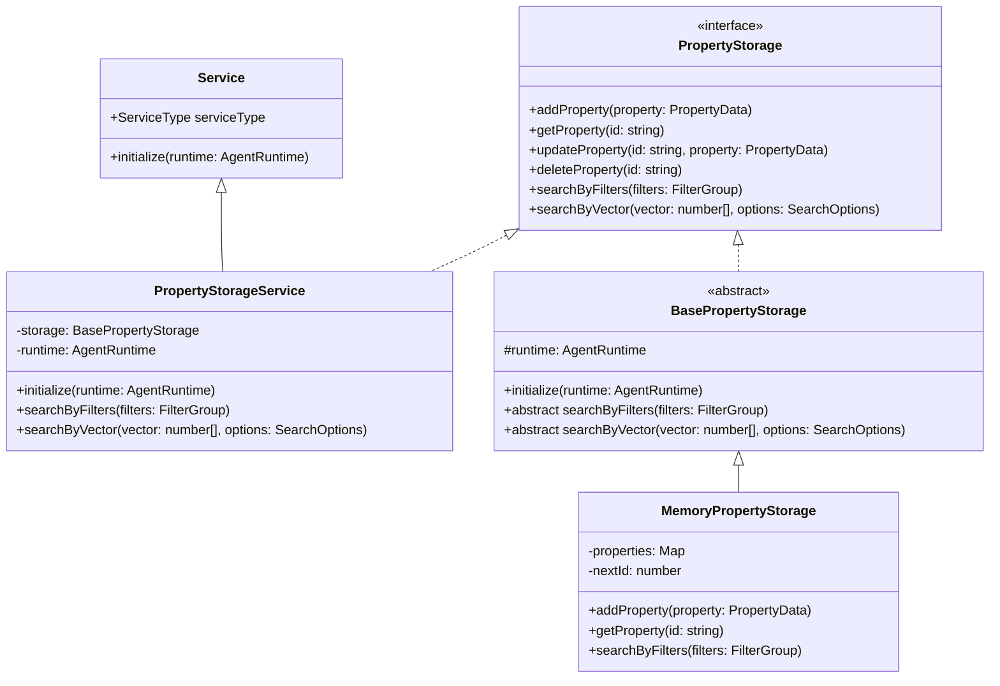
```mermaid
classDiagram
    Service <|-- PropertyStorageService
    PropertyStorage <|.. PropertyStorageService
    PropertyStorage <|.. BasePropertyStorage
    BasePropertyStorage <|-- MemoryPropertyStorage

    class Service {
        +ServiceType serviceType
        +initialize(runtime: AgentRuntime)
    }

    class PropertyStorage {
        <<interface>>
        +addProperty(property: PropertyData)
        +getProperty(id: string)
        +updateProperty(id: string, property: PropertyData)
        +deleteProperty(id: string)
        +searchByFilters(filters: FilterGroup)
        +searchByVector(vector: number[], options: SearchOptions)
    }

    class PropertyStorageService {
        -storage: BasePropertyStorage
        -runtime: AgentRuntime
        +initialize(runtime: AgentRuntime)
        +searchByFilters(filters: FilterGroup)
        +searchByVector(vector: number[], options: SearchOptions)
    }

    class BasePropertyStorage {
        <<abstract>>
        #runtime: AgentRuntime
        +initialize(runtime: AgentRuntime)
        +abstract searchByFilters(filters: FilterGroup)
        +abstract searchByVector(vector: number[], options: SearchOptions)
    }

    class MemoryPropertyStorage {
        -properties: Map<string, PropertyData>
        -nextId: number
        +addProperty(property: PropertyData)
        +getProperty(id: string)
        +searchByFilters(filters: FilterGroup)
    }
```

## Component Interaction
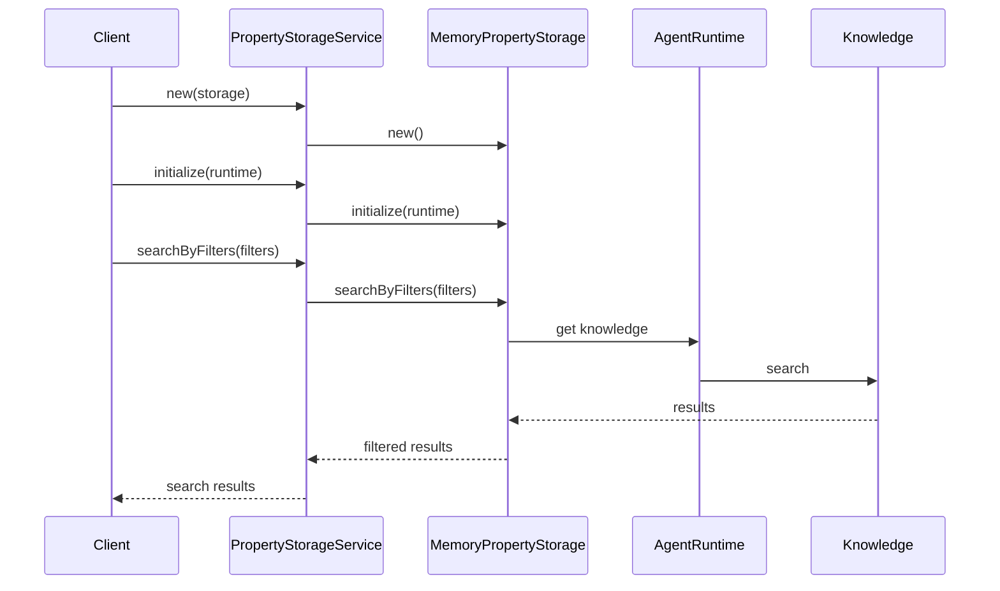
```mermaid
sequenceDiagram
    participant Client
    participant PropertyStorageService
    participant MemoryPropertyStorage
    participant AgentRuntime
    participant Knowledge

    Client->>PropertyStorageService: new(storage)
    PropertyStorageService->>MemoryPropertyStorage: new()
    Client->>PropertyStorageService: initialize(runtime)
    PropertyStorageService->>MemoryPropertyStorage: initialize(runtime)
    
    Client->>PropertyStorageService: searchByFilters(filters)
    PropertyStorageService->>MemoryPropertyStorage: searchByFilters(filters)
    MemoryPropertyStorage->>AgentRuntime: get knowledge
    AgentRuntime->>Knowledge: search
    Knowledge-->>MemoryPropertyStorage: results
    MemoryPropertyStorage-->>PropertyStorageService: filtered results
    PropertyStorageService-->>Client: search results
```

## Runtime State Flow
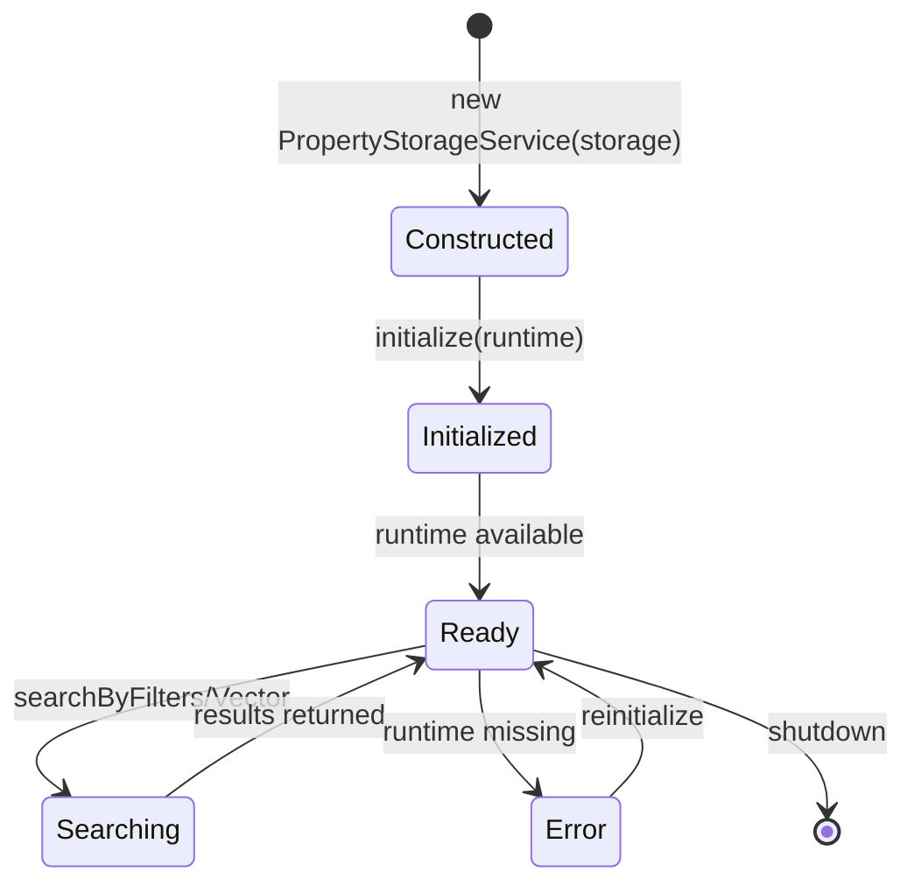
```mermaid
stateDiagram-v2
    [*] --> Constructed: new PropertyStorageService(storage)
    Constructed --> Initialized: initialize(runtime)
    Initialized --> Ready: runtime available
    Ready --> Searching: searchByFilters/Vector
    Searching --> Ready: results returned
    Ready --> Error: runtime missing
    Error --> Ready: reinitialize
    Ready --> [*]: shutdown
```

## Data Flow
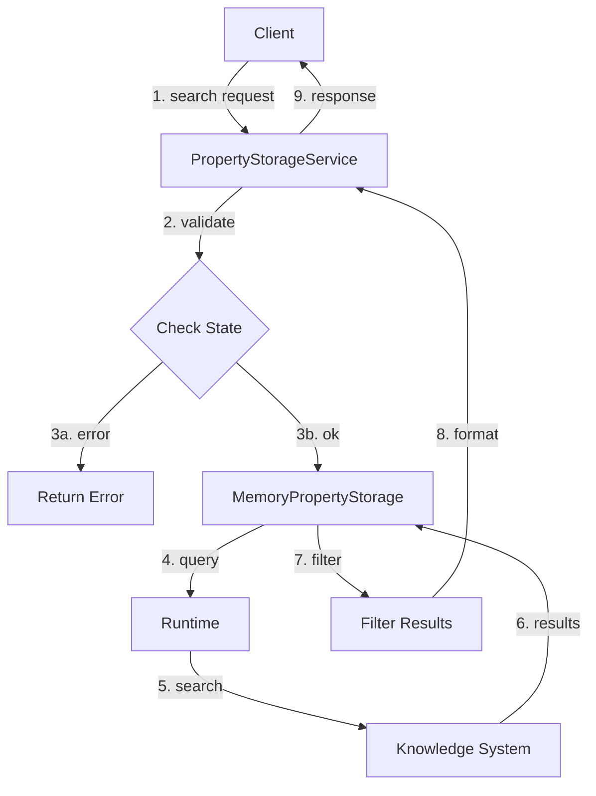
```mermaid
flowchart TD
    Client[Client] --> |1. search request| PSS[PropertyStorageService]
    PSS --> |2. validate| Check{Check State}
    Check --> |3a. error| Error[Return Error]
    Check --> |3b. ok| MPS[MemoryPropertyStorage]
    MPS --> |4. query| RT[Runtime]
    RT --> |5. search| K[Knowledge System]
    K --> |6. results| MPS
    MPS --> |7. filter| Results[Filter Results]
    Results --> |8. format| PSS
    PSS --> |9. response| Client
```

## Component Architecture
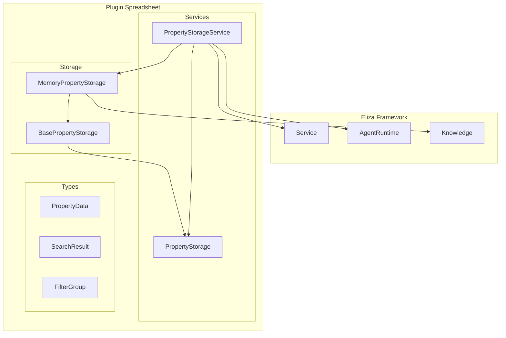
```mermaid
graph TB
    subgraph Eliza Framework
        Service
        AgentRuntime
        Knowledge
    end

    subgraph Plugin Spreadsheet
        subgraph Services
            PropertyStorageService --> Service
            PropertyStorageService --> PropertyStorage
        end
        
        subgraph Storage
            BasePropertyStorage --> PropertyStorage
            MemoryPropertyStorage --> BasePropertyStorage
        end

        subgraph Types
            PropertyData
            SearchResult
            FilterGroup
        end
    end

    PropertyStorageService --> MemoryPropertyStorage
    MemoryPropertyStorage --> Knowledge
    PropertyStorageService --> AgentRuntime
```

## Initialization Flow
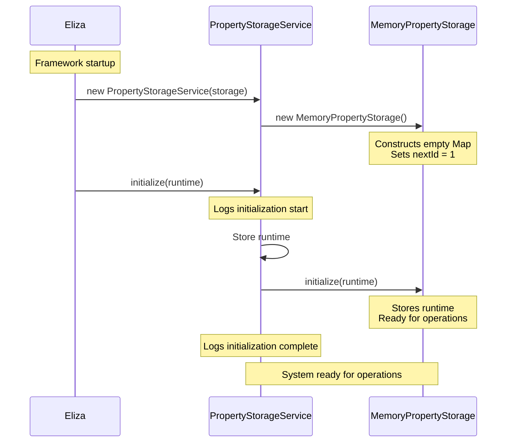
```mermaid
sequenceDiagram
    participant Eliza
    participant PSS as PropertyStorageService
    participant MPS as MemoryPropertyStorage
    
    Note over Eliza: Framework startup
    
    Eliza->>PSS: new PropertyStorageService(storage)
    PSS->>MPS: new MemoryPropertyStorage()
    Note over MPS: Constructs empty Map<br/>Sets nextId = 1
    
    Eliza->>PSS: initialize(runtime)
    Note over PSS: Logs initialization start
    PSS->>PSS: Store runtime
    PSS->>MPS: initialize(runtime)
    Note over MPS: Stores runtime<br/>Ready for operations
    Note over PSS: Logs initialization complete
    
    Note over PSS,MPS: System ready for operations
```

## Abstract Class Structure
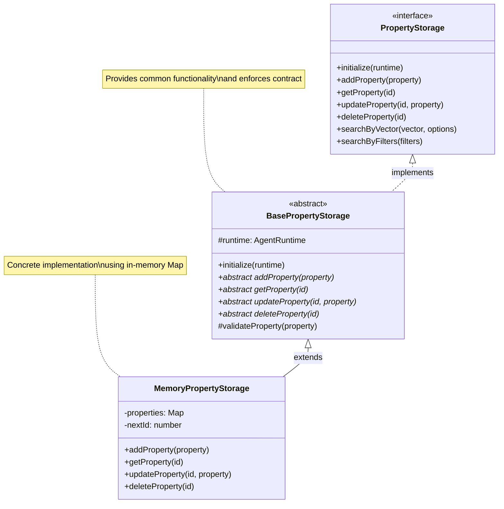
```mermaid
classDiagram
    class PropertyStorage {
        <<interface>>
        +initialize(runtime)
        +addProperty(property)
        +getProperty(id)
        +updateProperty(id, property)
        +deleteProperty(id)
        +searchByVector(vector, options)
        +searchByFilters(filters)
    }
    
    class BasePropertyStorage {
        <<abstract>>
        #runtime: AgentRuntime
        +initialize(runtime)
        +abstract addProperty(property)*
        +abstract getProperty(id)*
        +abstract updateProperty(id, property)*
        +abstract deleteProperty(id)*
        #validateProperty(property)
    }
    
    class MemoryPropertyStorage {
        -properties: Map
        -nextId: number
        +addProperty(property)
        +getProperty(id)
        +updateProperty(id, property)
        +deleteProperty(id)
    }
    
    PropertyStorage <|.. BasePropertyStorage : implements
    BasePropertyStorage <|-- MemoryPropertyStorage : extends
    
    note for BasePropertyStorage "Provides common functionality\nand enforces contract"
    note for MemoryPropertyStorage "Concrete implementation\nusing in-memory Map"
```

## Error Handling Flow
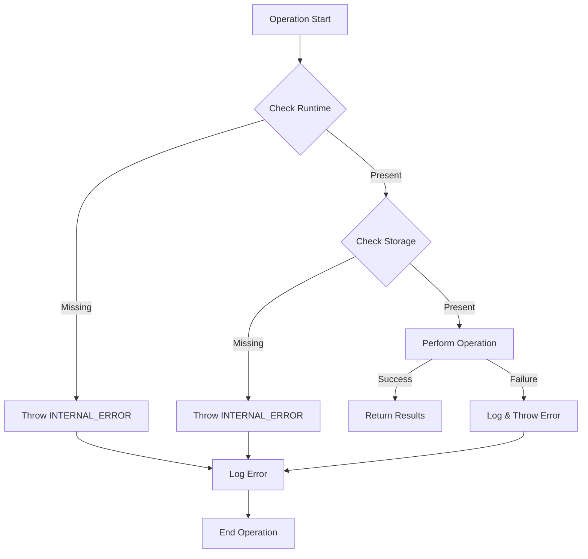
```mermaid
flowchart TD
    Start[Operation Start] --> Check{Check Runtime}
    Check --> |Missing| E1[Throw INTERNAL_ERROR]
    Check --> |Present| Next{Check Storage}
    Next --> |Missing| E2[Throw INTERNAL_ERROR]
    Next --> |Present| Op[Perform Operation]
    Op --> |Success| Return[Return Results]
    Op --> |Failure| E3[Log & Throw Error]
    E1 --> Log[Log Error]
    E2 --> Log
    E3 --> Log
    Log --> End[End Operation]
```

## Map Operations
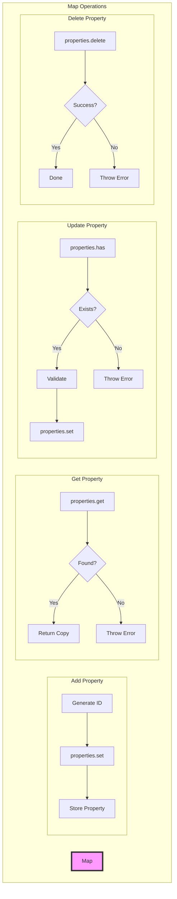
```mermaid
graph TD
    subgraph Map Operations
        direction LR
        M[Map<string, PropertyData>]
        
        subgraph Add Property
            A1[Generate ID] --> A2[properties.set]
            A2 --> A3[Store Property]
        end
        
        subgraph Get Property
            G1[properties.get] --> G2{Found?}
            G2 -->|Yes| G3[Return Copy]
            G2 -->|No| G4[Throw Error]
        end
        
        subgraph Update Property
            U1[properties.has] --> U2{Exists?}
            U2 -->|Yes| U3[Validate] --> U4[properties.set]
            U2 -->|No| U5[Throw Error]
        end
        
        subgraph Delete Property
            D1[properties.delete] --> D2{Success?}
            D2 -->|Yes| D3[Done]
            D2 -->|No| D4[Throw Error]
        end
    end
    
    style M fill:#f9f,stroke:#333,stroke-width:4px
```

## MemoryPropertyStorage Deep Dive

### State Management
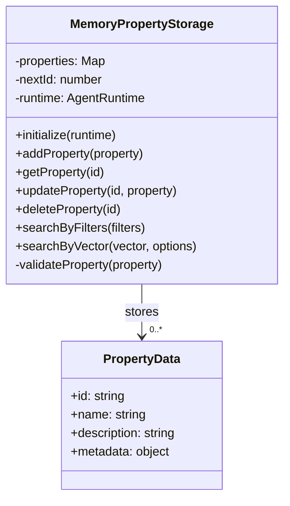
```mermaid
classDiagram
    class MemoryPropertyStorage {
        -properties: Map<string, PropertyData>
        -nextId: number
        -runtime: AgentRuntime
        +initialize(runtime)
        +addProperty(property)
        +getProperty(id)
        +updateProperty(id, property)
        +deleteProperty(id)
        +searchByFilters(filters)
        +searchByVector(vector, options)
        -validateProperty(property)
    }
    
    class PropertyData {
        +id: string
        +name: string
        +description: string
        +metadata: object
    }
    
    MemoryPropertyStorage --> "0..*" PropertyData : stores
```

### Search Flow
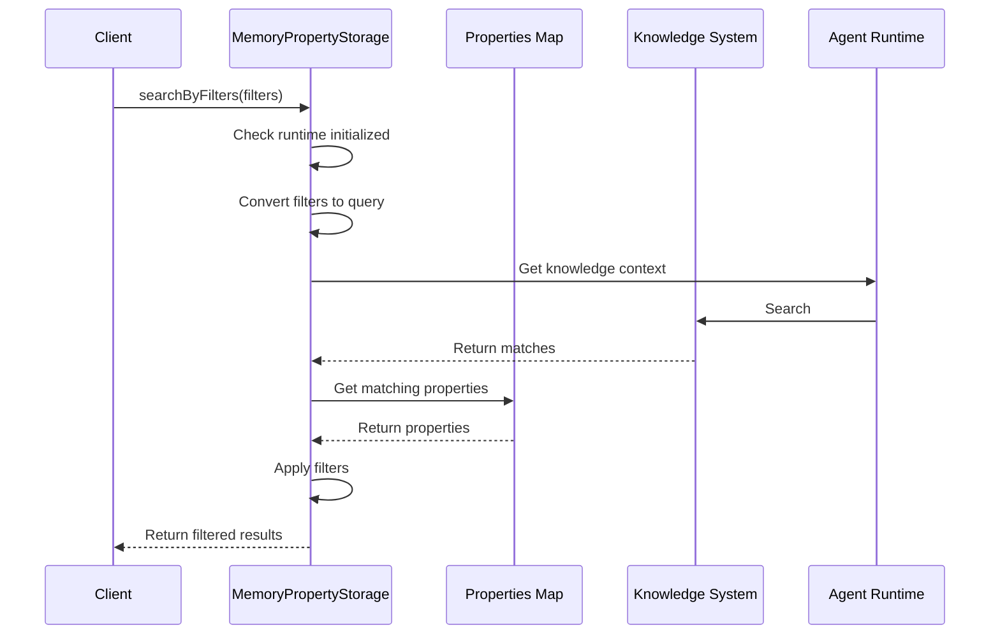
```mermaid
sequenceDiagram
    participant Client
    participant MPS as MemoryPropertyStorage
    participant Map as Properties Map
    participant Knowledge as Knowledge System
    participant Runtime as Agent Runtime
    
    Client->>MPS: searchByFilters(filters)
    MPS->>MPS: Check runtime initialized
    MPS->>MPS: Convert filters to query
    MPS->>Runtime: Get knowledge context
    Runtime->>Knowledge: Search
    Knowledge-->>MPS: Return matches
    MPS->>Map: Get matching properties
    Map-->>MPS: Return properties
    MPS->>MPS: Apply filters
    MPS-->>Client: Return filtered results
```

### Property Lifecycle
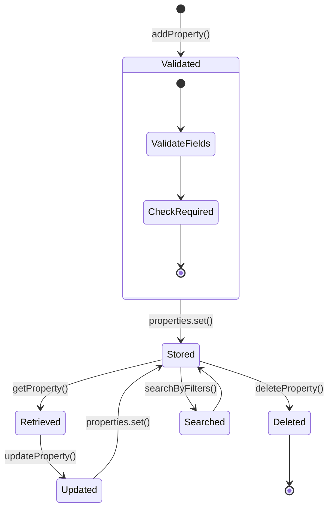
```mermaid
stateDiagram-v2
    [*] --> Validated: addProperty()
    Validated --> Stored: properties.set()
    Stored --> Retrieved: getProperty()
    Retrieved --> Updated: updateProperty()
    Updated --> Stored: properties.set()
    Stored --> Deleted: deleteProperty()
    Deleted --> [*]
    
    Stored --> Searched: searchByFilters()
    Searched --> Stored
    
    state Validated {
        [*] --> ValidateFields
        ValidateFields --> CheckRequired
        CheckRequired --> [*]
    }
```

### Implementation Details

#### 1. Core Data Structure
```typescript
class MemoryPropertyStorage {
    private properties: Map<string, PropertyData> = new Map();
    private nextId: number = 1;
    private runtime: AgentRuntime | null = null;
}
```
- Uses JavaScript Map for O(1) access
- Maintains auto-incrementing ID
- Stores runtime for knowledge operations

#### 2. Key Operations

##### Add Property
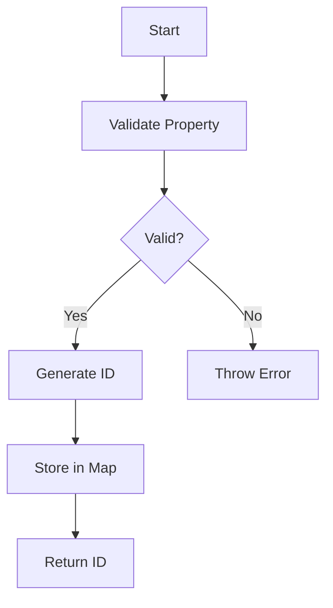
```mermaid
flowchart TD
    A[Start] --> B[Validate Property]
    B --> C{Valid?}
    C -->|Yes| D[Generate ID]
    D --> E[Store in Map]
    E --> F[Return ID]
    C -->|No| G[Throw Error]
```

##### Search By Filters
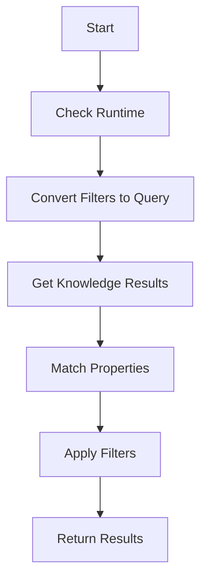
```mermaid
flowchart TD
    A[Start] --> B[Check Runtime]
    B --> C[Convert Filters to Query]
    C --> D[Get Knowledge Results]
    D --> E[Match Properties]
    E --> F[Apply Filters]
    F --> G[Return Results]
```

#### 3. Error Handling
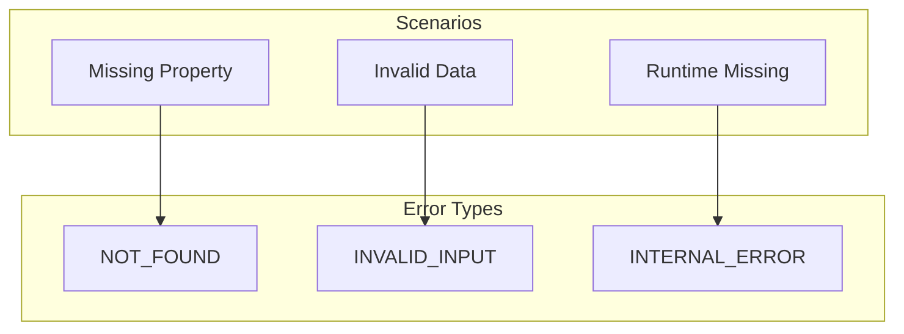
```mermaid
flowchart TD
    subgraph Error Types
        E1[NOT_FOUND]
        E2[INVALID_INPUT]
        E3[INTERNAL_ERROR]
    end
    
    subgraph Scenarios
        S1[Missing Property] --> E1
        S2[Invalid Data] --> E2
        S3[Runtime Missing] --> E3
    end
```

### Key Features

1. **In-Memory Storage**
   - Fast access and operations
   - No persistence between restarts
   - Thread-safe operations

2. **ID Management**
   - Auto-incrementing IDs
   - Guaranteed uniqueness
   - Simple string format

3. **Property Validation**
   - Required field checking
   - Type validation
   - Format validation

4. **Search Capabilities**
   - Filter-based search
   - Vector similarity search
   - Knowledge system integration

5. **Runtime Integration**
   - Connects to Eliza runtime
   - Accesses knowledge system
   - Handles runtime state

### Best Practices

1. **Data Management**
   - Always validate before storing
   - Return copies of objects
   - Handle missing data gracefully

2. **Error Handling**
   - Use specific error codes
   - Include detailed messages
   - Log important operations

3. **Search Operations**
   - Check runtime before search
   - Convert filters properly
   - Handle empty results

4. **Performance**
   - Keep properties small
   - Use efficient iterations
   - Cache when possible

### Limitations

1. **Memory Constraints**
   - Limited by available RAM
   - No persistence
   - No transaction support

2. **Search Limitations**
   - Basic filter matching
   - No complex indexing
   - Limited sorting options

3. **Scalability**
   - Single instance only
   - No distributed support
   - No replication

### Usage Examples

```typescript
// Initialize
const storage = new MemoryPropertyStorage();
await storage.initialize(runtime);

// Add property
const id = await storage.addProperty({
    name: "Test Property",
    description: "A test property"
});

// Search
const results = await storage.searchByFilters({
    operator: 'AND',
    filters: [
        { field: 'location', operator: '$in', value: 'beach' },
        { field: 'price', operator: '$lt', value: 1000000 }
    ]
});
```

## Knowledge System Integration

### Knowledge Flow
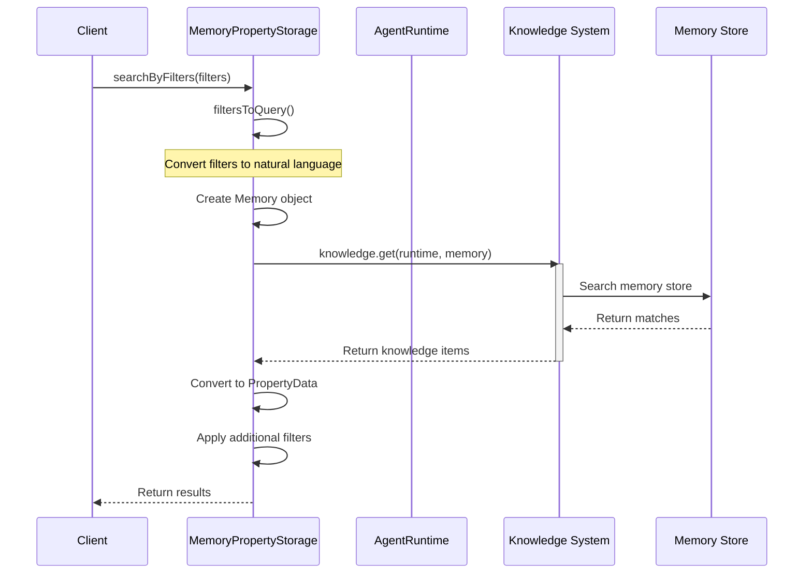
```mermaid
sequenceDiagram
    participant Client
    participant Storage as MemoryPropertyStorage
    participant Runtime as AgentRuntime
    participant Knowledge as Knowledge System
    participant Memory as Memory Store
    
    Client->>Storage: searchByFilters(filters)
    Storage->>Storage: filtersToQuery()
    
    Note over Storage: Convert filters to natural language
    
    Storage->>Storage: Create Memory object
    Storage->>Knowledge: knowledge.get(runtime, memory)
    
    activate Knowledge
    Knowledge->>Memory: Search memory store
    Memory-->>Knowledge: Return matches
    Knowledge-->>Storage: Return knowledge items
    deactivate Knowledge
    
    Storage->>Storage: Convert to PropertyData
    Storage->>Storage: Apply additional filters
    Storage-->>Client: Return results
```

### Filter to Query Conversion
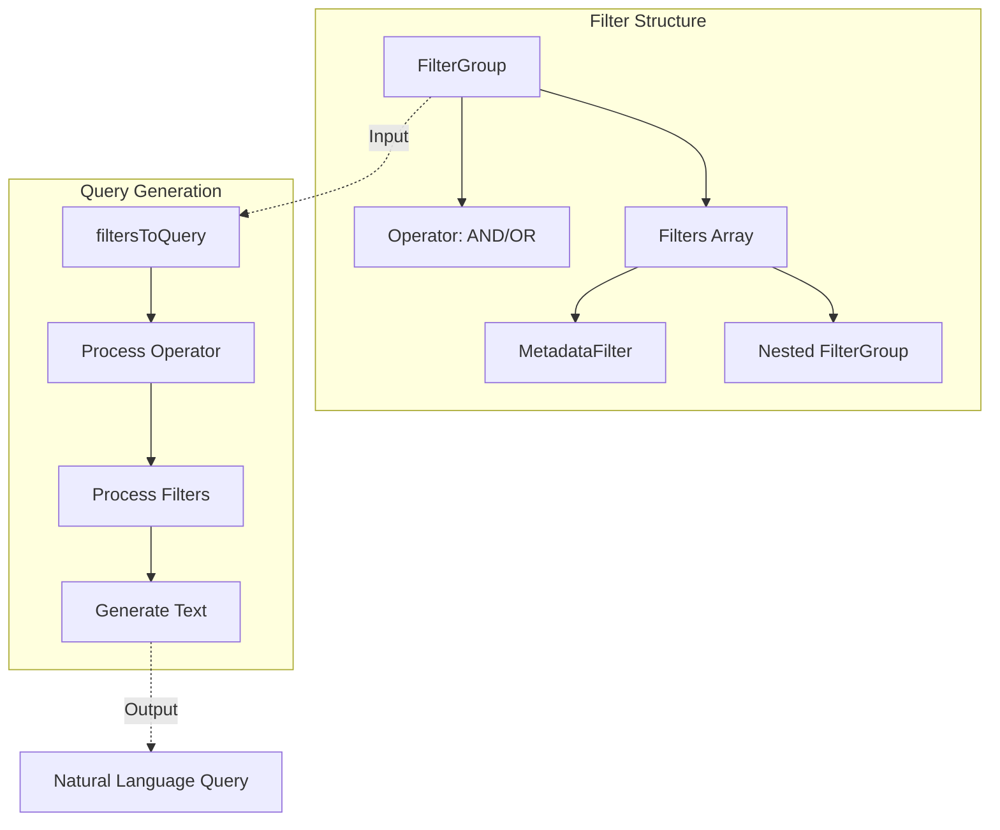
```mermaid
flowchart TD
    subgraph Filter Structure
        F1[FilterGroup] --> F2[Operator: AND/OR]
        F1 --> F3[Filters Array]
        F3 --> F4[MetadataFilter]
        F3 --> F5[Nested FilterGroup]
    end
    
    subgraph Query Generation
        Q1[filtersToQuery] --> Q2[Process Operator]
        Q2 --> Q3[Process Filters]
        Q3 --> Q4[Generate Text]
    end
    
    F1 -.->|Input| Q1
    Q4 -.->|Output| T1[Natural Language Query]
```

### Memory Object Structure
```typescript
const memory: Memory = {
    agentId: runtime.agentId,
    userId: runtime.agentId,
    roomId: runtime.agentId,
    content: {
        text: queryText  // Converted from filters
    }
};
```

### Knowledge Integration Details

1. **Filter Translation**
   ```mermaid
   flowchart LR
       subgraph Input
           F1[FilterGroup] --> F2[field: name]
           F1 --> F3[operator: contains]
           F1 --> F4[value: beach]
       end
       
       subgraph Output
           Q1[Natural language query]
       end
       
       Input --> Translation --> Output
   ```

2. **Knowledge Response Processing**
   ```mermaid
   flowchart TD
       K1[Knowledge Items] --> P1[Extract Metadata]
       P1 --> P2[Convert to PropertyData]
       P2 --> P3[Apply Filters]
       P3 --> P4[Create SearchResult]
       
       subgraph Results
           R1[ID]
           R2[Property]
           R3[Similarity]
           R4[Matched Filters]
       end
       
       P4 --> Results
   ```
   ```mermaid
   flowchart TD
       K1[Knowledge Items] --> P1[Extract Metadata]
       P1 --> P2[Convert to PropertyData]
       P2 --> P3[Apply Filters]
       P3 --> P4[Create SearchResult]
       
       subgraph Results
           R1[ID]
           R2[Property]
           R3[Similarity]
           R4[Matched Filters]
       end
       
       P4 --> Results
   ```

### Example Knowledge Flow

```typescript
// 1. Input Filter
const filters = {
    operator: 'AND',
    filters: [
        { field: 'location', operator: '$in', value: 'beach' },
        { field: 'price', operator: '$lt', value: 1000000 }
    ]
};

// 2. Generated Query
const query = "Find properties located near the beach with price less than 1 million";

// 3. Memory Object
const memory = {
    agentId: runtime.agentId,
    content: { text: query }
};

// 4. Knowledge Response
const knowledgeItems = await knowledge.get(runtime, memory);

// 5. Converted Results
const results = knowledgeItems.map(item => ({
    id: item.id,
    property: item.content.metadata,
    similarity: 1.0,
    matchedFilters: []
}));
```

### Key Points

1. **Query Generation**
   - Filters are converted to natural language
   - Complex filters are handled recursively
   - Query is optimized for knowledge search

2. **Knowledge Integration**
   - Uses Eliza's knowledge system
   - Maintains runtime context
   - Handles async operations

3. **Result Processing**
   - Converts knowledge items to properties
   - Applies additional filtering
   - Maintains metadata and context

4. **Error Handling**
   - Validates runtime availability
   - Handles knowledge system errors
   - Provides detailed error context

### Best Practices

1. **Query Construction**
   - Keep queries focused and specific
   - Use natural language patterns
   - Include relevant context

2. **Result Handling**
   - Process results in batches
   - Validate metadata conversion
   - Apply post-processing filters

3. **Error Management**
   - Check runtime before queries
   - Handle knowledge system timeouts
   - Provide fallback behavior

## Filter to Query Conversion

### Filter Structure
```typescript
interface FilterGroup {
    operator: 'AND' | 'OR';
    filters: (MetadataFilter | FilterGroup)[];
}

interface MetadataFilter {
    field: string;
    operator: string;
    value: any;
}
```

### Conversion Process
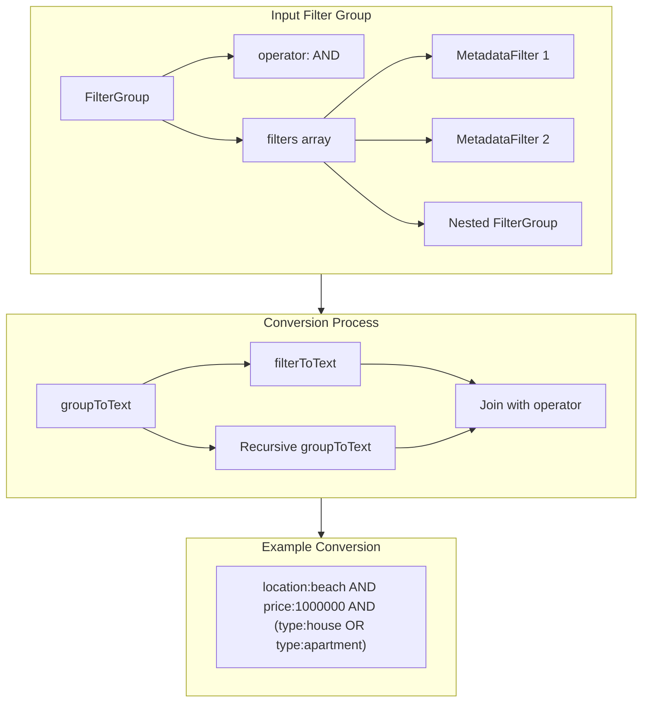
```mermaid
flowchart TD
    subgraph Input[Input Filter Group]
        F1[FilterGroup] --> O1[operator: AND]
        F1 --> FA[filters array]
        FA --> MF1[MetadataFilter 1]
        FA --> MF2[MetadataFilter 2]
        FA --> NFG[Nested FilterGroup]
    end

    subgraph Process[Conversion Process]
        GT[groupToText] --> FT[filterToText]
        GT --> RGT[Recursive groupToText]
        FT --> Join[Join with operator]
        RGT --> Join
    end

    subgraph Example[Example Conversion]
        E1["location:beach AND price:1000000 AND (type:house OR type:apartment)"]
    end

    Input --> Process
    Process --> Example
```

### How It Works

1. **Base Case - Single Filter**
   ```typescript
   filterToText(filter: MetadataFilter): string {
       return `${filter.field}:${filter.value}`;
   }
   ```
   - Converts a single filter to "field:value"
   - Example: `{ field: 'price', value: 1000000 }` → `"price:1000000"`

2. **Recursive Case - Filter Group**
   ```typescript
   groupToText(group: FilterGroup): string {
       const filterTexts = group.filters.map(f =>
           'operator' in f ? groupToText(f) : filterToText(f)
       );
       return filterTexts.join(group.operator === 'AND' ? ' AND ' : ' OR ');
   }
   ```
   - Maps each filter through either `filterToText` or recursive `groupToText`
   - Joins results with AND/OR based on group operator

### Example Walkthrough

```typescript
const filters = {
    operator: 'AND',
    filters: [
        { field: 'location', value: 'beach' },
        { field: 'price', value: 1000000 },
        {
            operator: 'OR',
            filters: [
                { field: 'type', value: 'house' },
                { field: 'type', value: 'apartment' }
            ]
        }
    ]
};

// Step 1: Process top-level AND group
//   → Map each filter:
//     1. "location:beach"
//     2. "price:1000000"
//     3. Process nested OR group:
//        → Map nested filters:
//          - "type:house"
//          - "type:apartment"
//        → Join with OR: "(type:house OR type:apartment)"
//   → Join all with AND

// Final Result:
// "location:beach AND price:1000000 AND (type:house OR type:apartment)"
```

### Key Points

1. **Recursion**
   - Handles nested filter groups of any depth
   - Each group is processed independently
   - Results are combined based on operators

2. **Type Checking**
   - Uses `'operator' in f` to distinguish between:
     - MetadataFilter (single filter)
     - FilterGroup (nested group)

3. **String Building**
   - Builds query from bottom up
   - Maintains operator precedence
   - Creates human-readable format

4. **Use Cases**
   - Complex property searches
   - Multi-criteria filtering
   - Nested condition groups
