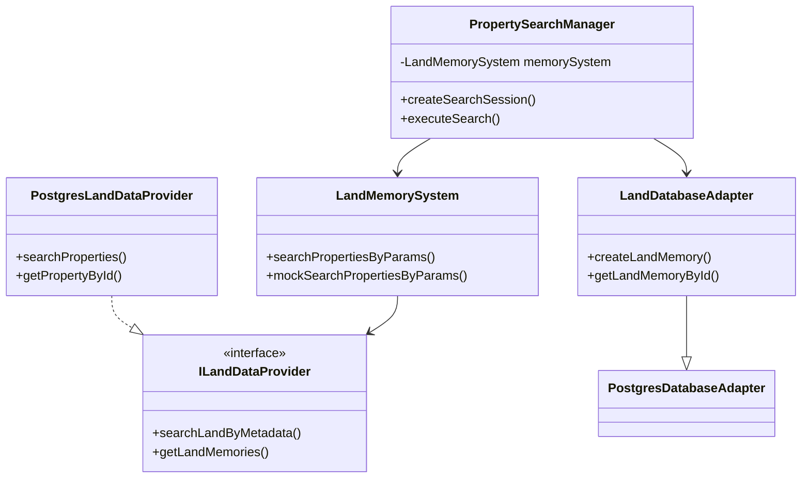
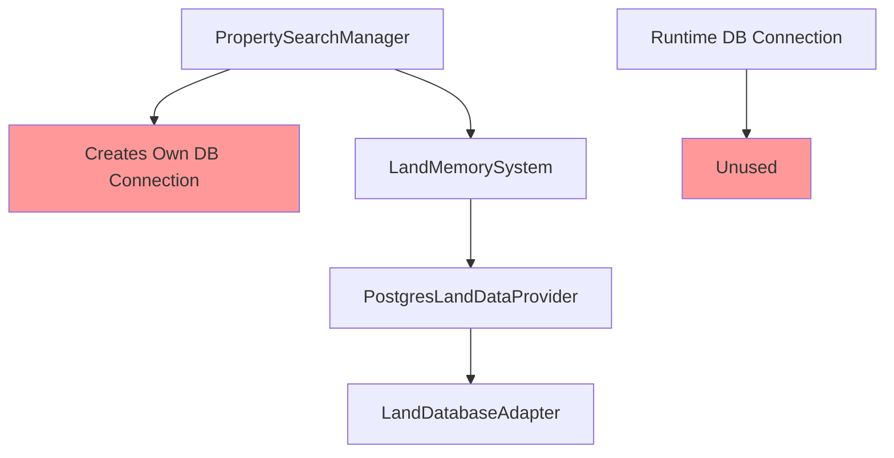
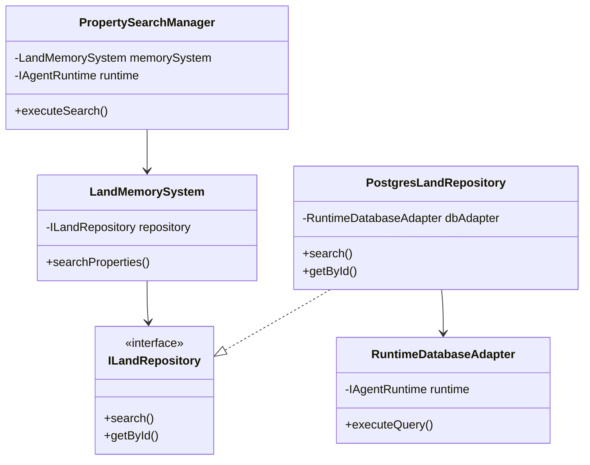
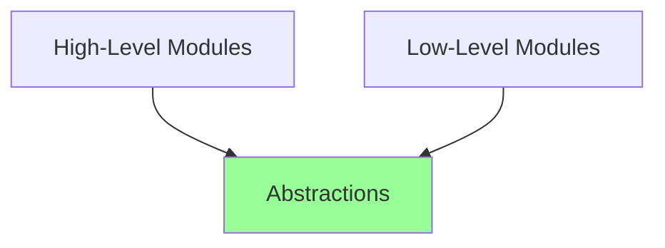

# Land Property Search System Architecture

## Table of Contents
1. [Current Architecture](#current-architecture)
2. [Problems and Challenges](#problems-and-challenges)
3. [Proposed Architecture](#proposed-architecture)
4. [Implementation Guide](#implementation-guide)
5. [Object-Oriented Design Principles](#object-oriented-design-principles)

## Current Architecture

### System Overview
The Land Property Search System is designed to manage and search property data in a virtual land marketplace. 

### Current Object Relationships


### Current Components

1. **PropertySearchManager**
   - Primary coordinator for search operations
   - Creates its own database connection
   - Manages search sessions and results
   - Currently creates redundant database connections

2. **LandDatabaseAdapter**
   - Extends PostgresDatabaseAdapter
   - Handles direct database operations
   - Problem: Duplicates runtime database functionality

3. **PostgresLandDataProvider**
   - Implements ILandDataProvider interface
   - Missing required methods
   - Interface mismatch issues

4. **LandMemorySystem**
   - Manages property data and search operations
   - Tightly coupled with database implementation

## Problems and Challenges

### 1. Database Connection Management
- Multiple database connections created
- Runtime's database connection not utilized
- Resource inefficiency

### 2. Architectural Issues


### 3. Interface Mismatches
- Provider implementation doesn't match interface
- Inconsistent method names
- Missing required functionality

## Proposed Architecture

### New Object Relationships


### Key Improvements

1. **Repository Pattern Implementation**
```typescript
interface ILandRepository {
    search(params: SearchParams): Promise<Property[]>;
    getById(id: string): Promise<Property>;
    save(property: Property): Promise<void>;
}
```

2. **Runtime Database Adapter**
```typescript
class RuntimeDatabaseAdapter {
    constructor(private runtime: IAgentRuntime) {}
    
    async executeQuery(query: string, params: any[]): Promise<any> {
        return this.runtime.databaseAdapter.query(query, params);
    }
}
```

3. **Factory Pattern Usage**
```typescript
class LandSystemFactory {
    static create(runtime: IAgentRuntime): PropertySearchManager {
        const dbAdapter = new RuntimeDatabaseAdapter(runtime);
        const repository = new PostgresLandRepository(dbAdapter);
        const memorySystem = new LandMemorySystem(repository);
        return new PropertySearchManager(memorySystem, runtime);
    }
}
```

## Implementation Guide

### Step 1: Create Base Interfaces
```typescript
interface ILandRepository {
    search(params: SearchParams): Promise<Property[]>;
    getById(id: string): Promise<Property>;
    save(property: Property): Promise<void>;
}
```

### Step 2: Implement Repository
```typescript
class PostgresLandRepository implements ILandRepository {
    constructor(private dbAdapter: RuntimeDatabaseAdapter) {}
    
    async search(params: SearchParams): Promise<Property[]> {
        // Implementation using runtime database adapter
    }
}
```

### Step 3: Update LandMemorySystem
```typescript
class LandMemorySystem {
    constructor(private repository: ILandRepository) {}
    
    async searchProperties(params: SearchParams): Promise<Property[]> {
        return this.repository.search(params);
    }
}
```

## Object-Oriented Design Principles

### 1. Encapsulation
- Hide implementation details
- Expose only necessary interfaces
- Example: Repository pattern hiding database details

### 2. Dependency Inversion


### 3. Single Responsibility
Each class should have one reason to change:
- Repository: Data access
- Memory System: Business logic
- Search Manager: Coordination

### Design Pattern Benefits

1. **Repository Pattern**
   - Abstracts data access
   - Consistent interface
   - Easy to test

2. **Adapter Pattern**
   - Converts between interfaces
   - Reuses runtime functionality
   - Clean integration

3. **Factory Pattern**
   - Centralizes object creation
   - Manages dependencies
   - Simplifies system setup

## Migration Strategy

1. **Phase 1: Interface Alignment**
   - Create new interfaces
   - Update existing implementations
   - Add missing methods

2. **Phase 2: Repository Implementation**
   - Create new repository class
   - Implement using runtime database
   - Update memory system

3. **Phase 3: Dependency Injection**
   - Update constructors
   - Implement factory
   - Remove direct database creation
