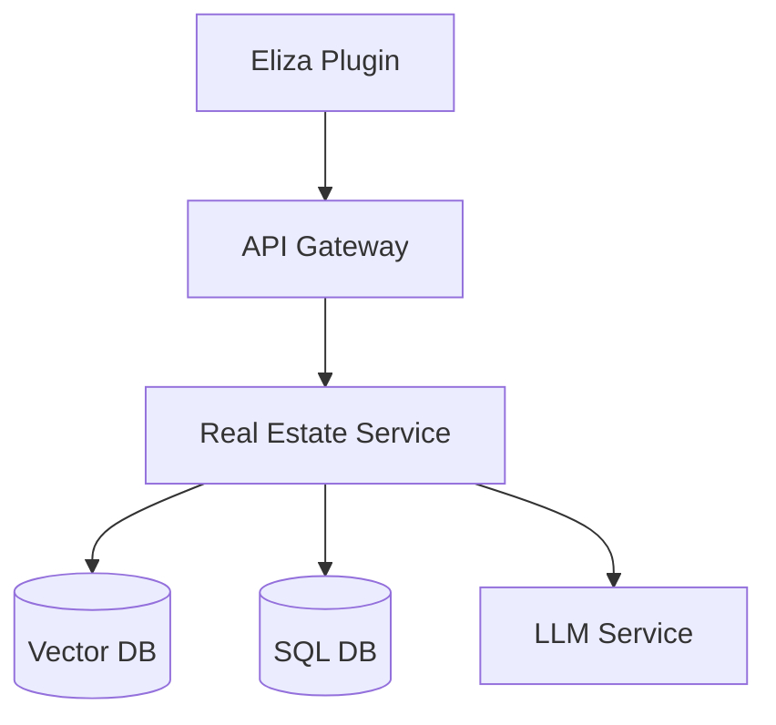

# Real Estate Semantic Search Cloud Service Design

## System Architecture



## 1. Cloud Service Components

### 1.1 API Gateway
```typescript
// api-gateway.ts
interface RealEstateAPI {
    // Semantic Search Endpoints
    POST /api/v1/properties/search
    body: {
        query: string;          // Natural language query
        filters?: FilterGroup;  // Optional structured filters
        limit?: number;        // Max results
        offset?: number;       // For pagination
    }
    response: {
        results: Property[];
        totalCount: number;
        appliedFilters: FilterGroup;
    }

    // Direct Field Query Endpoints
    GET /api/v1/properties
    params: {
        neighborhood?: string[];
        minHeight?: number;
        maxHeight?: number;
        nearOcean?: boolean;    // Within 500m
        nearBay?: boolean;      // Within 500m
        minFloors?: number;
        maxFloors?: number;
        sortBy?: string;        // field name
        sortOrder?: 'asc'|'desc';
    }
    
    // Vector Operations
    POST /api/v1/vectors/compute
    body: {
        text: string;  // Property description or query
    }
    response: {
        vector: number[];  // Embedding vector
    }
}
```

### 1.2 Database Schema
```sql
-- PostgreSQL with pgvector extension

-- Properties table
CREATE TABLE properties (
    id UUID PRIMARY KEY,
    name VARCHAR(255),
    neighborhood VARCHAR(100),
    zoning_type VARCHAR(50),
    plot_size VARCHAR(50),
    building_size VARCHAR(50),
    max_floors INTEGER,
    min_floors INTEGER,
    plot_area DECIMAL,
    max_building_height DECIMAL,
    min_building_height DECIMAL,
    ocean_distance_meters DECIMAL,
    bay_distance_meters DECIMAL,
    description TEXT,
    embedding vector(1536),  -- For semantic search
    created_at TIMESTAMP,
    updated_at TIMESTAMP
);

-- Spatial index for distance queries
CREATE INDEX idx_properties_location 
ON properties USING gist (
    point(ocean_distance_meters, bay_distance_meters)
);

-- Vector index for semantic search
CREATE INDEX idx_properties_embedding 
ON properties USING ivfflat (embedding vector_cosine_ops)
WITH (lists = 100);
```

### 1.3 Vector Search Implementation
```typescript
// vector-search.ts
class VectorSearchService {
    async searchProperties(query: string, filters?: FilterGroup) {
        // 1. Get query embedding from LLM service
        const queryVector = await this.llmService.getEmbedding(query);
        
        // 2. Find similar vectors with PostgreSQL
        const sql = `
            WITH vector_matches AS (
                SELECT 
                    id,
                    1 - (embedding <=> $1) as similarity
                FROM properties
                WHERE 1 - (embedding <=> $1) > 0.7  -- Similarity threshold
                ORDER BY similarity DESC
                LIMIT 100
            )
            SELECT p.*, vm.similarity
            FROM properties p
            JOIN vector_matches vm ON p.id = vm.id
            WHERE ${this.buildFilterSQL(filters)}
            ORDER BY vm.similarity DESC
            LIMIT $2;
        `;
        
        return await this.db.query(sql, [queryVector, 10]);
    }

    private buildFilterSQL(filters?: FilterGroup): string {
        if (!filters) return "TRUE";
        return this.translateFilters(filters);
    }

    private translateFilters(group: FilterGroup): string {
        const conditions = group.filters.map(filter => {
            if ('operator' in filter) {
                return this.translateFilters(filter);
            }
            return this.translateFilter(filter);
        });

        return `(${conditions.join(
            group.operator === 'AND' ? ' AND ' : ' OR '
        )})`;
    }
}
```

## 2. Eliza Plugin Integration

### 2.1 Plugin Structure
```typescript
// real-estate-plugin.ts
export const realEstatePlugin: Plugin = {
    name: "real-estate",
    description: "Search and analyze real estate properties",
    actions: [
        {
            name: "search-properties",
            description: "Search properties using natural language",
            parameters: {
                query: { type: "string" },
                limit: { type: "number", optional: true }
            },
            handler: async (runtime: AgentRuntime, params) => {
                const api = new RealEstateAPI(runtime.config.apiKey);
                
                // Call cloud service
                const results = await api.searchProperties({
                    query: params.query,
                    limit: params.limit || 10
                });

                // Format results for Eliza
                return results.map(property => ({
                    content: {
                        text: property.description,
                        metadata: property
                    },
                    score: property.similarity
                }));
            }
        },
        {
            name: "filter-properties",
            description: "Find properties by specific criteria",
            parameters: {
                criteria: { 
                    type: "object",
                    properties: {
                        neighborhood: { type: "string", optional: true },
                        minHeight: { type: "number", optional: true },
                        maxHeight: { type: "number", optional: true },
                        // ... other filters
                    }
                }
            },
            handler: async (runtime: AgentRuntime, params) => {
                const api = new RealEstateAPI(runtime.config.apiKey);
                return await api.getProperties(params.criteria);
            }
        }
    ]
};
```

### 2.2 API Client
```typescript
// api-client.ts
class RealEstateAPI {
    constructor(private apiKey: string) {}

    async searchProperties(params: SearchParams) {
        const response = await fetch(
            `${this.baseUrl}/properties/search`,
            {
                method: 'POST',
                headers: {
                    'Authorization': `Bearer ${this.apiKey}`,
                    'Content-Type': 'application/json'
                },
                body: JSON.stringify(params)
            }
        );
        return await response.json();
    }

    async getProperties(filters: PropertyFilters) {
        const queryString = new URLSearchParams(
            this.flattenFilters(filters)
        ).toString();
        
        const response = await fetch(
            `${this.baseUrl}/properties?${queryString}`,
            {
                headers: {
                    'Authorization': `Bearer ${this.apiKey}`
                }
            }
        );
        return await response.json();
    }
}
```

## 3. Key Features

### 3.1 Hybrid Search
The system combines:
- Vector similarity (for semantic understanding)
- SQL filters (for precise criteria)
- Spatial queries (for location-based search)

### 3.2 Performance Optimizations
1. Vector indexing using IVF-Flat
2. Spatial indexing for distance queries
3. Caching common queries
4. Pagination support
5. Parallel query execution

### 3.3 Scalability Features
1. Read replicas for high query load
2. Vector computation service auto-scaling
3. API rate limiting and quotas
4. Result caching with Redis

## 4. Example Usage

```typescript
// Using the Eliza plugin
const results = await runtime.executeAction("real-estate", "search-properties", {
    query: "Find tall buildings near the ocean in Nexus",
    limit: 5
});

// Direct API usage
const api = new RealEstateAPI(apiKey);
const properties = await api.searchProperties({
    query: "oceanfront property with lots of floors",
    filters: {
        operator: "AND",
        filters: [
            { field: "neighborhood", operator: "$eq", value: "Nexus" },
            { field: "maxFloors", operator: "$gte", value: 100 }
        ]
    }
});
```

This design provides:
1. ✨ Semantic search via vector embeddings
2. 🎯 Precise filtering via SQL
3. 📍 Location-based queries
4. ⚡ High performance through indexing
5. 🔄 Easy integration with Eliza
6. 📈 Scalability for large datasets
