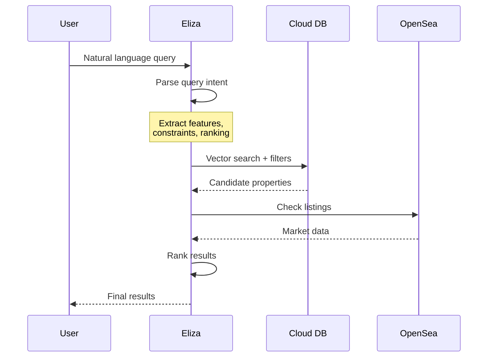

# 3. Query Processing

## Multi-Phase Query System

### Phase 1: Query Understanding
```typescript
interface QueryIntent {
    propertyFeatures: {
        location?: string[];
        amenities?: string[];
        proximity?: Array<{
            to: string;
            distance: number;
        }>;
    };
    marketConstraints: {
        maxPrice?: number;
        currency?: string;
        mustBeListed?: boolean;
        priceComparison?: 'below_floor' | 'below_average';
    };
    ranking: {
        primarySort: 'price' | 'similarity' | 'distance';
        order: 'asc' | 'desc';
    };
}
```

### Phase 2: Property Search
```typescript
interface PropertyQuery {
    vectorSearch?: {
        embedding: number[];
        minSimilarity: number;
    };
    filters: FilterGroup;
    limit: number;
    offset: number;
}
```

### Phase 3: Market Integration
```typescript
interface MarketQuery {
    properties: Array<{
        tokenId: string;
        contractAddress: string;
    }>;
    constraints: {
        maxPrice?: number;
        listedOnly: boolean;
    };
}
```

## Query Flow



## Implementation Details

### 1. Query Parser
```typescript
class QueryParser {
    async parseQuery(query: string): Promise<{
        intent: QueryIntent;
        vector?: number[];
        filters: FilterGroup;
    }> {
        // Use LLM to understand query
        const intent = await this.llm.parseIntent(query);
        
        // Generate search vector if needed
        const vector = needsVectorSearch(intent)
            ? await this.getEmbedding(query)
            : undefined;
            
        // Convert intent to filters
        const filters = this.intentToFilters(intent);
        
        return { intent, vector, filters };
    }
}
```

### 2. Search Coordinator
```typescript
class SearchCoordinator {
    async search(
        query: string,
        options: SearchOptions
    ): Promise<SearchResult[]> {
        // Phase 1: Parse query
        const { intent, vector, filters } = 
            await this.parser.parseQuery(query);
        
        // Phase 2: Property search
        const properties = await this.storage.searchProperties({
            vectorSearch: vector ? { vector, minSimilarity: 0.7 } : undefined,
            filters,
            limit: options.limit
        });
        
        // Phase 3: Market enrichment
        const enriched = await this.market.enrichWithMarketData(
            properties,
            intent.marketConstraints
        );
        
        // Final ranking
        return this.rankResults(enriched, intent.ranking);
    }
}
```

## Optimizations

### 1. Caching
```typescript
class QueryCache {
    // Cache parsed intents
    intentCache: Map<string, QueryIntent>;
    
    // Cache property results
    resultCache: Map<string, PropertyData[]>;
    
    // Cache market data
    marketCache: Map<string, MarketStatus>;
}
```

### 2. Parallel Processing
```typescript
async function parallelEnrichment(properties: PropertyData[]) {
    const [
        marketData,
        priceHistory,
        neighborhoodStats
    ] = await Promise.all([
        getMarketData(properties),
        getPriceHistory(properties),
        getNeighborhoodStats(properties)
    ]);
    
    return mergeResults(
        properties,
        marketData,
        priceHistory,
        neighborhoodStats
    );
}
```

### 3. Smart Batching
```typescript
class MarketDataBatcher {
    private queue: PropertyData[] = [];
    private batchSize = 50;
    private batchDelay = 100;  // ms

    async addToBatch(property: PropertyData) {
        this.queue.push(property);
        if (this.queue.length >= this.batchSize) {
            await this.processBatch();
        }
    }
}
```

## Example Queries

1. **Location + Market**
   ```
   "find cheap beachfront properties in Nexus listed under 5 ETH"
   ```

2. **Investment Focus**
   ```
   "show properties listed below floor price with good location"
   ```

3. **Analysis**
   ```
   "compare property prices between Nexus and Flashing Lights"
   ```

## Performance Considerations

1. **Query Understanding**
   - Cache common queries
   - Batch LLM requests
   - Pre-compute embeddings

2. **Property Search**
   - Efficient indexes
   - Result pagination
   - Early filtering

3. **Market Data**
   - Rate limiting
   - Data caching
   - Batch requests
