# Development Plan - December 27, 2023

## Today's Goal
Implement Phase 1 of the storage abstraction layer, focusing on the core interface and local storage implementation.

## Timeline (Today)

```mermaid
gantt
    title Today's Development Plan
    dateFormat  HH:mm
    axisFormat %H:%M
    section Morning
    Design Storage Interface     :10:00, 1h
    Implement Local Storage     :11:00, 1h
    section Afternoon
    Basic Vector Search         :13:00, 2h
    Testing & Documentation     :15:00, 2h
```



## Tasks

### 1. Storage Interface Design (10:00 - 11:00)
- [ ] Define `PropertyStorage` interface
- [ ] Design data models
- [ ] Document interface methods
- [ ] Create type definitions

### 2. Local Storage Implementation (11:00 - 12:00)
- [ ] Implement `ElizaMemoryStorage`
- [ ] Add basic CRUD operations
- [ ] Implement in-memory indexing
- [ ] Add error handling

### 3. Vector Search Implementation (13:00 - 15:00)
- [ ] Implement cosine similarity
- [ ] Add vector search method
- [ ] Optimize for performance
- [ ] Add search options

### 4. Testing & Documentation (15:00 - 17:00)
- [ ] Write unit tests
- [ ] Add usage examples
- [ ] Document performance characteristics
- [ ] Create integration guide

## Code Milestones

### 1. Storage Interface
```typescript
interface PropertyStorage {
    // Core operations
    addProperty(property: PropertyData): Promise<string>;
    getProperty(id: string): Promise<PropertyData>;
    updateProperty(id: string, property: PropertyData): Promise<void>;
    deleteProperty(id: string): Promise<void>;

    // Search operations
    searchByVector(vector: number[], options: SearchOptions): Promise<SearchResult[]>;
    searchByFilters(filters: FilterGroup): Promise<SearchResult[]>;
}
```

### 2. Local Implementation
```typescript
class ElizaMemoryStorage implements PropertyStorage {
    private properties: Map<string, PropertyData & { vector: number[] }>;
    
    async searchByVector(vector: number[], options: SearchOptions) {
        // Implement vector search
    }
}
```

## Expected Outcomes

1. **Working Code**
   - Storage interface
   - Local implementation
   - Basic search functionality

2. **Documentation**
   - Interface documentation
   - Usage examples
   - Performance notes

3. **Tests**
   - Unit tests
   - Integration tests
   - Performance benchmarks

## Next Steps (Tomorrow)
1. Enhance vector search
2. Add metadata filtering
3. Implement batch operations
4. Start cloud storage design

## Questions to Address
1. How to handle vector similarity threshold?
2. Best approach for in-memory indexing?
3. Optimal batch size for operations?
4. Caching strategy?
