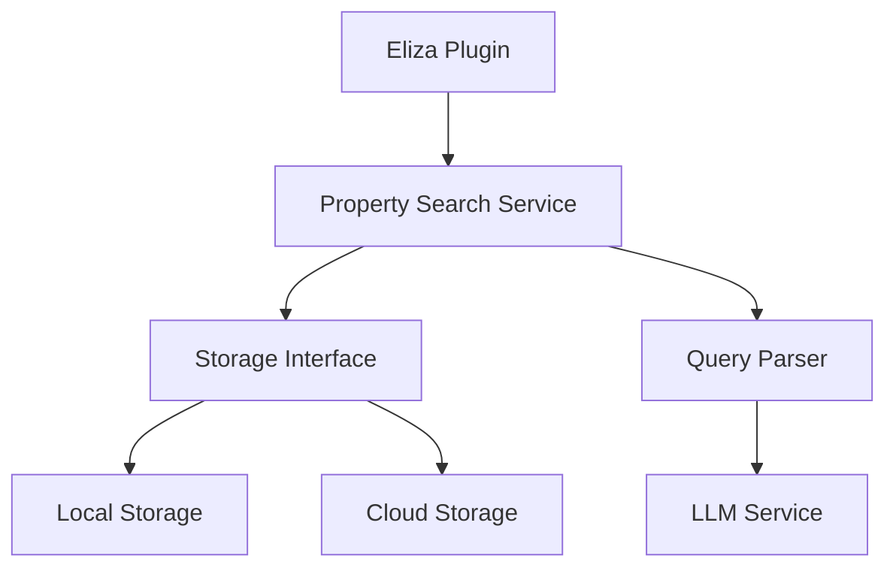
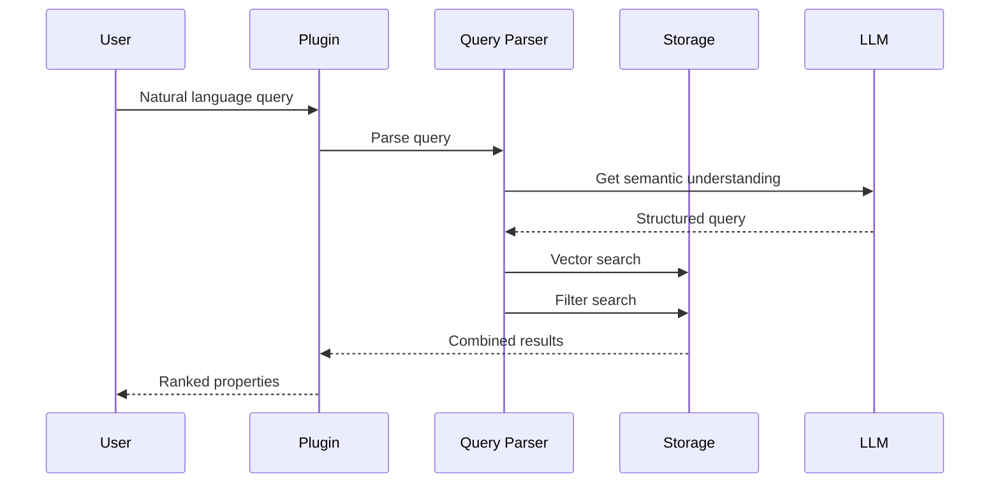

# Real Estate Semantic Search: High-Level Design

## Overview

A flexible and scalable system for semantic property search that supports both local and cloud-based storage while maintaining high performance and extensibility.



## 1. Core Components

### 1.1 Property Search Service
- Central coordinator for search operations
- Handles query parsing and result ranking
- Manages storage backend selection

### 1.2 Storage Interface
- Abstract interface for property storage
- Supports vector similarity search
- Handles structured filters

### 1.3 Query Parser
- Converts natural language to structured queries
- Uses LLM for semantic understanding
- Generates filter groups

## 2. Data Models

### 2.1 Property Data
```typescript
interface PropertyData {
    id: string;
    name: string;
    neighborhood: string;
    zoningType: string;
    plotSize: string;
    buildingSize: string;
    maxFloors: number;
    minFloors: number;
    plotArea: number;
    maxBuildingHeight: number;
    minBuildingHeight: number;
    oceanDistanceMeters: number;
    bayDistanceMeters: number;
    description: string;
}
```

### 2.2 Search Models
```typescript
interface SearchOptions {
    limit: number;
    threshold: number;
    includeMetadata: boolean;
}

interface SearchResult {
    property: PropertyData;
    similarity: number;
    matchedFilters?: string[];
}

interface FilterGroup {
    operator: 'AND' | 'OR';
    filters: (MetadataFilter | FilterGroup)[];
}
```

## 3. Component Details

### 3.1 Storage Layer
```typescript
interface PropertyStorage {
    // Core operations
    addProperty(property: PropertyData): Promise<string>;
    getProperty(id: string): Promise<PropertyData>;
    updateProperty(id: string, property: PropertyData): Promise<void>;
    deleteProperty(id: string): Promise<void>;

    // Search operations
    searchByVector(vector: number[], options: SearchOptions): Promise<SearchResult[]>;
    searchByFilters(filters: FilterGroup): Promise<SearchResult[]>;
    
    // Batch operations
    bulkLoad(properties: PropertyData[]): Promise<void>;
}
```

### 3.2 Query Processing
```typescript
interface QueryProcessor {
    // Convert natural language to structured query
    parseQuery(query: string): Promise<{
        filters: FilterGroup;
        vector?: number[];
        metadata?: Record<string, any>;
    }>;

    // Rank and combine results
    rankResults(
        vectorResults: SearchResult[],
        filterResults: SearchResult[]
    ): SearchResult[];
}
```

## 4. Implementation Phases

### Phase 1: Core Infrastructure
- ✅ Define interfaces and data models
- ✅ Implement local storage
- ✅ Basic query parsing
- ✅ Simple ranking system

### Phase 2: Enhanced Search
- 🔄 Advanced query parsing with LLM
- 🔄 Improved vector similarity
- 🔄 Better result ranking
- 🔄 Performance optimizations

### Phase 3: Cloud Integration
- ⏳ Cloud storage implementation
- ⏳ API design and implementation
- ⏳ Authentication and security
- ⏳ Scaling considerations

### Phase 4: Advanced Features
- 📋 Hybrid storage support
- 📋 Real-time updates
- 📋 Caching layer
- 📋 Advanced spatial queries

## 5. Storage Implementations

### 5.1 Local Storage (ElizaMemoryStorage)
- In-memory vector storage
- Fast local operations
- Good for development and small datasets

```typescript
class ElizaMemoryStorage implements PropertyStorage {
    private properties: Map<string, PropertyData & { vector: number[] }>;
    
    async searchByVector(vector: number[], options: SearchOptions) {
        return Array.from(this.properties.values())
            .map(prop => ({
                property: prop,
                similarity: cosineSimilarity(vector, prop.vector)
            }))
            .sort((a, b) => b.similarity - a.similarity)
            .slice(0, options.limit);
    }
}
```

### 5.2 Cloud Storage (Future)
- PostgreSQL with pgvector
- REST API interface
- Scalable and distributed

```typescript
class CloudPropertyStorage implements PropertyStorage {
    constructor(private apiClient: RealEstateAPI) {}
    
    async searchByVector(vector: number[], options: SearchOptions) {
        return this.apiClient.searchSimilar({
            vector,
            limit: options.limit,
            threshold: options.threshold
        });
    }
}
```

## 6. Query Processing Pipeline



## 7. Performance Considerations

### 7.1 Local Storage
- Vector calculations in memory
- Efficient data structures
- Result caching

### 7.2 Cloud Storage
- Connection pooling
- Request batching
- Response caching
- Parallel queries

## 8. Extension Points

### 8.1 New Storage Backends
- Different vector databases
- Other cloud providers
- Custom implementations

### 8.2 Enhanced Search Features
- Geographical search
- Time-based queries
- Custom ranking algorithms

### 8.3 Advanced Functionality
- Real-time updates
- Subscription features
- Analytics and reporting

## 9. Security Considerations

### 9.1 Data Protection
- Encryption at rest
- Secure transmission
- Access control

### 9.2 API Security
- Authentication
- Rate limiting
- Request validation

## 10. Future Enhancements

### 10.1 Immediate Term
- Improved query parsing
- Better result ranking
- Performance optimization

### 10.2 Medium Term
- Cloud storage support
- Advanced filters
- Caching layer

### 10.3 Long Term
- Real-time updates
- Advanced analytics
- Machine learning features

## 11. Development Guidelines

### 11.1 Code Organization
```
src/
  ├── storage/
  │   ├── interface.ts
  │   ├── local.ts
  │   └── cloud.ts
  ├── query/
  │   ├── parser.ts
  │   └── ranking.ts
  ├── models/
  │   └── property.ts
  └── index.ts
```

### 11.2 Testing Strategy
- Unit tests for each component
- Integration tests for storage
- End-to-end search tests
- Performance benchmarks

### 11.3 Documentation
- Interface documentation
- Implementation guides
- Example usage
- Performance tips

## 12. Conclusion

This design provides a flexible foundation that:
- Works well for current needs
- Scales for future growth
- Maintains clean abstractions
- Enables easy extensions

The phased implementation approach allows for:
- Early value delivery
- Incremental improvements
- Risk management
- Feature prioritization
