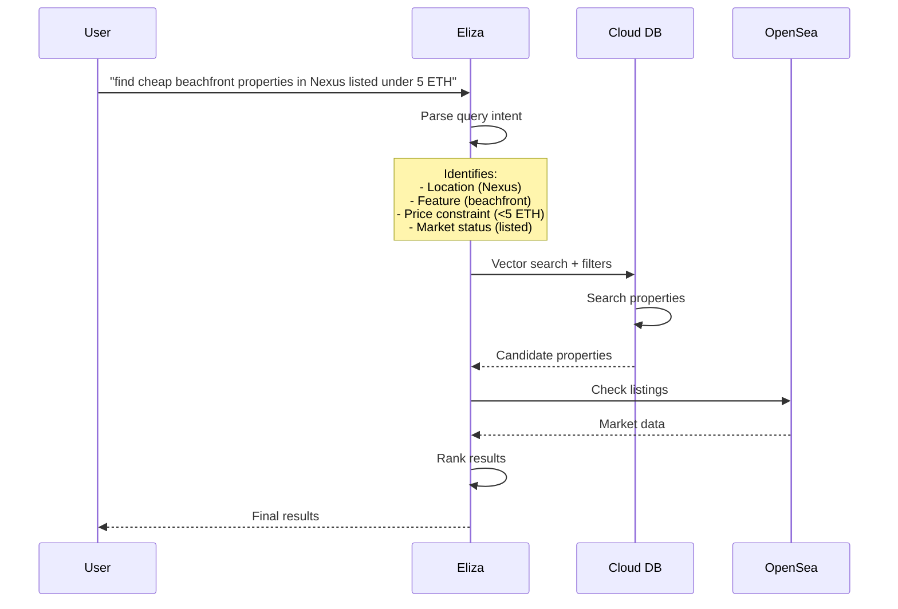

# Multi-Phase Property Search Design

## Query Flow



## Phase Details

### Phase 1: Query Understanding 🧠
```typescript
interface QueryIntent {
    propertyFeatures: {
        location?: string[];
        amenities?: string[];
        proximity?: Array<{
            to: string;
            distance: number;
        }>;
    };
    marketConstraints: {
        maxPrice?: number;
        currency?: string;
        mustBeListed?: boolean;
        priceComparison?: 'below_floor' | 'below_average';
    };
    ranking: {
        primarySort: 'price' | 'similarity' | 'distance';
        order: 'asc' | 'desc';
    };
}

// Example parsed query
const intent: QueryIntent = {
    propertyFeatures: {
        location: ['Nexus'],
        proximity: [{ to: 'beach', distance: 500 }]
    },
    marketConstraints: {
        maxPrice: 5,
        currency: 'ETH',
        mustBeListed: true
    },
    ranking: {
        primarySort: 'price',
        order: 'asc'
    }
};
```

### Phase 2: Property Search 🏠
```typescript
interface PropertyQuery {
    // Vector similarity
    vectorSearch?: {
        embedding: number[];
        minSimilarity: number;
    };
    
    // Metadata filters
    filters: FilterGroup;
    
    // Result size
    limit: number;
    offset: number;
}

// Cloud DB API
class CloudPropertyService {
    async searchProperties(query: PropertyQuery): Promise<{
        properties: PropertyData[];
        total: number;
        neighborhoods: string[];  // For faceted search
        priceRange: {min: number; max: number};
    }> {
        // Efficient DB query using indexes
        // Returns enriched property data
    }
}
```

### Phase 3: Market Integration 💰
```typescript
interface MarketQuery {
    properties: Array<{
        tokenId: string;
        contractAddress: string;
    }>;
    constraints: {
        maxPrice?: number;
        listedOnly: boolean;
    };
}

class MarketService {
    async enrichWithMarketData(
        properties: PropertyData[],
        constraints: MarketQuery['constraints']
    ): Promise<Array<PropertyData & {
        market: MarketStatus;
        analysis: MarketAnalysis;
    }>> {
        // Parallel OpenSea API calls
        // Enrich with market data
    }
}
```

## Example Flow

```typescript
async function searchProperties(
    query: string,
    options: SearchOptions
): Promise<SearchResult[]> {
    // Phase 1: Parse Query
    const intent = await elizaLLM.parseIntent(query);
    
    // Phase 2: Property Search
    const propertyResults = await cloudDB.searchProperties({
        vectorSearch: {
            embedding: await getEmbedding(query),
            minSimilarity: 0.7
        },
        filters: translateIntentToFilters(intent)
    });
    
    // Phase 3: Market Check
    const enrichedResults = await marketService.enrichWithMarketData(
        propertyResults.properties,
        intent.marketConstraints
    );
    
    // Final Ranking
    return rankResults(enrichedResults, intent.ranking);
}
```

## Benefits

1. **Efficient Processing** ⚡
   - Each phase optimized for its task
   - Parallel processing where possible
   - Early filtering reduces load

2. **Rich Context** 🎯
   - Property features
   - Market status
   - Price analysis

3. **Flexible Architecture** 🔄
   - Easy to add new data sources
   - Can cache at each phase
   - Fallback options

## Example Queries

```typescript
// Complex market + property query
"find properties listed below floor price within 500m of the beach"

// Price trend analysis
"show me properties in Nexus where prices are trending up"

// Investment opportunities
"find undervalued beachfront properties with good price history"
```

## Performance Optimizations

1. **Caching Strategy** 📦
```typescript
class QueryCache {
    // Cache property results (short TTL)
    propertyCache: Map<string, PropertyData[]>;
    
    // Cache market data (very short TTL)
    marketCache: Map<string, MarketStatus>;
    
    // Cache neighborhood stats (longer TTL)
    statsCache: Map<string, NeighborhoodStats>;
}
```

2. **Parallel Processing** ⚡
```typescript
async function parallelEnrichment(properties: PropertyData[]) {
    const [
        marketData,
        priceHistory,
        neighborhoodStats
    ] = await Promise.all([
        getMarketData(properties),
        getPriceHistory(properties),
        getNeighborhoodStats(properties)
    ]);
    
    return mergeResults(
        properties,
        marketData,
        priceHistory,
        neighborhoodStats
    );
}
```

3. **Smart Batching** 🔄
```typescript
class MarketDataBatcher {
    private queue: PropertyData[] = [];
    private batchSize = 50;
    private batchDelay = 100;  // ms

    async addToBatch(property: PropertyData) {
        this.queue.push(property);
        if (this.queue.length >= this.batchSize) {
            await this.processBatch();
        }
    }
}
```

This multi-phase approach gives us:
1. 🎯 More accurate results
2. 💰 Real-time market data
3. 📊 Rich analysis
4. ⚡ Better performance
5. 🔄 Flexible architecture
