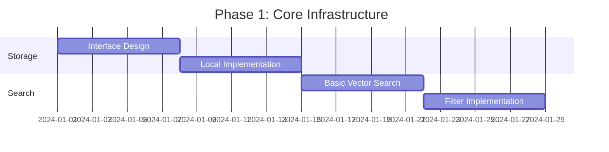
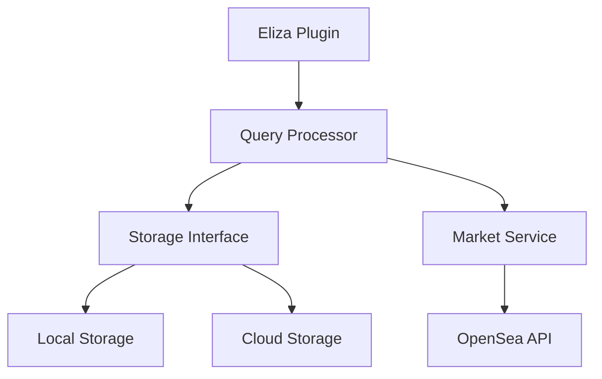
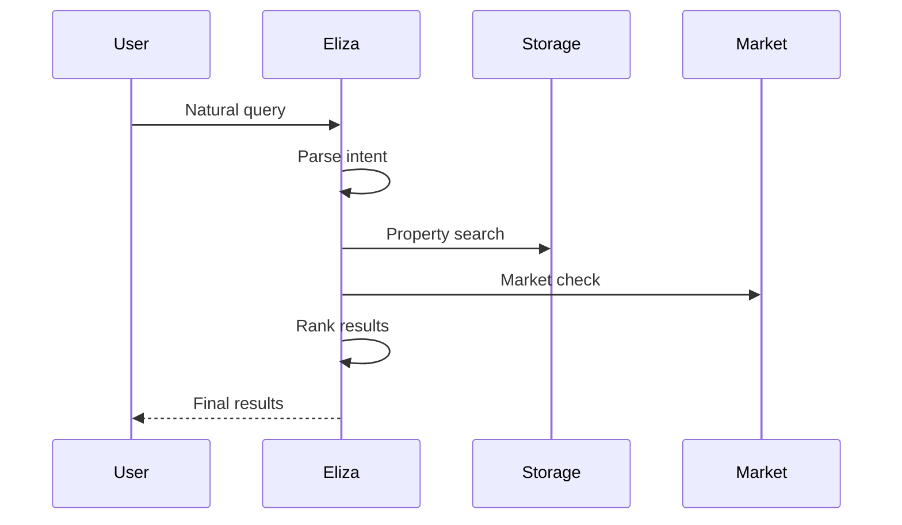

# NFT Real Estate Semantic Search: A Multi-Phase Query System

## Abstract

We present a novel approach to NFT real estate search that combines semantic understanding, vector similarity, and real-time market data. Our system integrates natural language processing with blockchain market data to provide an intuitive yet powerful property search experience. The architecture supports both local and cloud-based deployments, enabling scalability while maintaining development flexibility.

## 1. Introduction

The intersection of real estate and blockchain technology has created new opportunities and challenges in property search and valuation. Traditional search methods often fail to capture the nuanced requirements of users or incorporate real-time market dynamics. Our system addresses these limitations through a multi-phase query approach that combines semantic understanding with market intelligence.

### 1.1 Key Innovations
- Multi-phase query processing
- Real-time NFT market integration
- Flexible storage architecture
- Natural language understanding
- Hybrid search capabilities

## 2. Implementation Strategy

Our development approach emphasizes iterative progress and continuous validation:

### 2.1 Phase 1: Core Search Infrastructure (Weeks 1-4)


1. **Week 1: Storage Interface**
   ```typescript
   interface PropertyStorage {
       addProperty(property: PropertyData): Promise<string>;
       searchByVector(vector: number[], options: SearchOptions): Promise<SearchResult[]>;
       searchByFilters(filters: FilterGroup): Promise<SearchResult[]>;
   }
   ```

2. **Week 2: Local Storage**
   - In-memory implementation
   - Basic vector operations
   - Simple filtering

3. **Week 3: Vector Search**
   - Embedding generation
   - Similarity calculations
   - Result ranking

4. **Week 4: Filtering**
   - Metadata filters
   - Combined search
   - Result pagination

### 2.2 Phase 2: Natural Language Processing (Weeks 5-8)


1. **Week 5: Query Understanding**
   ```typescript
   interface QueryIntent {
       propertyFeatures: {
           location?: string[];
           amenities?: string[];
           proximity?: Array<{to: string; distance: number}>;
       };
       marketConstraints?: {
           maxPrice?: number;
           mustBeListed?: boolean;
       };
   }
   ```

2. **Week 6: Filter Generation**
   - Convert intents to filters
   - Handle complex queries
   - Validation rules

3. **Week 7: Multi-phase Integration**
   - Query pipeline
   - Result merging
   - Performance optimization

4. **Week 8: Result Ranking**
   - Scoring algorithms
   - Relevance tuning
   - User feedback integration

### 2.3 Phase 3: Market Integration (Weeks 9-12)


## 3. System Architecture

### 3.1 Core Components


### 3.2 Query Flow


## 4. Technical Implementation

### 4.1 Storage Layer
```typescript
class CloudPropertyStorage implements PropertyStorage {
    async searchByVector(vector: number[], options: SearchOptions) {
        return this.db.query(`
            WITH vector_matches AS (
                SELECT id, 1 - (embedding <=> $1) as similarity
                FROM properties
                WHERE 1 - (embedding <=> $1) > $2
                ORDER BY similarity DESC
                LIMIT $3
            )
            SELECT p.*, vm.similarity
            FROM properties p
            JOIN vector_matches vm ON p.id = vm.id
            WHERE ${this.buildFilterSQL(options.filters)}
            ORDER BY vm.similarity DESC
        `, [vector, options.threshold, options.limit]);
    }
}
```

### 4.2 Query Processing
```typescript
class QueryProcessor {
    async process(query: string): Promise<SearchResult[]> {
        // Phase 1: Understanding
        const intent = await this.parseIntent(query);
        
        // Phase 2: Property Search
        const properties = await this.storage.searchProperties({
            vector: await this.getEmbedding(query),
            filters: this.intentToFilters(intent)
        });
        
        // Phase 3: Market Enrichment
        return this.enrichWithMarketData(properties);
    }
}
```

### 4.3 Market Integration
```typescript
class MarketService {
    async enrichWithMarketData(
        properties: PropertyData[]
    ): Promise<EnrichedProperty[]> {
        const marketData = await Promise.all(
            properties.map(p => this.getMarketStatus(p.nft))
        );
        
        return properties.map((prop, i) => ({
            ...prop,
            market: marketData[i],
            analysis: this.analyzeMarketData(marketData[i])
        }));
    }
}
```

## 5. Performance Optimizations

### 5.1 Caching Strategy
```typescript
class QueryCache {
    // Short TTL for market data
    private marketCache = new TTLCache<string, MarketStatus>(5 * 60);
    
    // Longer TTL for property data
    private propertyCache = new TTLCache<string, PropertyData>(60 * 60);
    
    // Very short TTL for search results
    private searchCache = new TTLCache<string, SearchResult[]>(60);
}
```

### 5.2 Batch Processing
```typescript
class BatchProcessor {
    private queue: Array<{
        property: PropertyData;
        resolve: (data: MarketStatus) => void;
    }> = [];

    async add(property: PropertyData): Promise<MarketStatus> {
        return new Promise(resolve => {
            this.queue.push({ property, resolve });
            this.processBatchIfReady();
        });
    }
}
```

## 6. Future Enhancements

### 6.1 Advanced Features
1. Price prediction
2. Investment recommendations
3. Market trend analysis
4. Automated alerts

### 6.2 Technical Improvements
1. GraphQL API
2. Real-time updates
3. Machine learning integration
4. Advanced caching

## 7. Conclusion

Our system demonstrates how combining semantic search, blockchain data, and natural language processing can create a powerful property search experience. The multi-phase approach provides flexibility and extensibility while maintaining high performance.

## 8. References

1. Vector Similarity Search
   - "Efficient Vector Similarity Search in PostgreSQL"
   - "Approximate Nearest Neighbor Search in High Dimensions"

2. NFT Market Analysis
   - "Real-time NFT Market Analysis"
   - "Blockchain Data Indexing Strategies"

3. Natural Language Processing
   - "LLM-based Query Understanding"
   - "Semantic Search in Practice"
